<div>
  <div align="right">
    👆 右上角点击  告诉我，你希望这个项目继续加速开发迭代 ❤️ & ☕️
  </div>
  <h1> 🤖 Qbot </h1>
</div>

<p align="left">
    
    <a href='https://github.com/MShawon/github-clone-count-badge'></a>
     <code>since Sep 26</code>
</p>

[](https://github.com/UFund-Me/Qbot/actions/workflows/codeql-analysis.yml)
[](https://github.com/UFund-Me/Qbot/actions/workflows/auto-trade.yml)
[](https://github.com/UFund-Me/Qbot/actions/workflows/pylint.yml)
[](https://github.com/UFund-Me/Qbot/actions/workflows/coverage.yml)
<a href="https://github.com/UFund-Me/Qbot"></a>
<a href="https://ufund-me.github.io/Qbot/#/"></a>
<a href="https://deepwiki.com/UFund-Me/Qbot"></a>

<div align="center">
  <a href="https://github.com/UFund-Me/Qbot" target="_blank" rel="noopener">
    <picture>
      <source media="(prefers-color-scheme: dark)" alt="Qbot" srcset="https://user-images.githubusercontent.com/29084184/204598632-23c473db-92ee-4e9b-9b57-d6d95c861fdf.png" />
      
    </picture>
  </a>
  <div>&nbsp;</div>
  <div align="center">
    <b><font size="5">Qbot website</font></b>
    <sup>
      <a href="https://ufund-me.github.io/Qbot/#/">
        <i><font size="4">HOT</font></i>
      </a>
    </sup>
    &nbsp;&nbsp;&nbsp;&nbsp;
    <b><font size="5">Qbot DeepWiki</font></b>
    <sup>
      <a href="https://deepwiki.com/UFund-Me/Qbot">
        <i><font size="4">TRY IT OUT</font></i>
      </a>
    </sup>
  </div>
  <div>&nbsp;</div>
</div>

<div align="center">
  <p>AI智能量化投研平台</p>
</div>

>  <b>Qbot</b> is an AI-oriented automated quantitative investment platform, which aims to realize the potential, empower AI technologies in quantitative investment. Qbot supports diverse machine learning modeling paradigms. including supervised learning, market dynamics modeling, and RL.

<p id="demo">
  <!--  -->
  
</p>

```
🤖 Qbot = 智能交易策略 + 回测系统 + 自动化量化交易 (+ 可视化分析工具)
            |           |            |            |
            |           |            |             \_ quantstats (dashboard\online operation)
            |           |             \______________ Qbot - vnpy, pytrader, pyfunds
            |           \____________________________ BackTest - backtrader, easyquant
            \________________________________________ quant.ai - qlib, deep learning strategies
```

<br>

<div align="center">
  
  🎺 <b>号外</b>：Qbot微信小程序开发招募 [UFund-miniprogram](https://github.com/UFund-Me/UFund-miniprogram)

  <b>不建议 fork 项目，本项目会持续更新，只 fork 看不到更新，建议 Star ⭐️ ~</b>

  <i>喜欢这个项目吗？请考虑[ ❤️赞助](#sponsors--support) 本项目，以帮助改进！</i>

</div>

## Quick Start

Qbot是一个免费的量化投研平台，提供从数据获取、交易策略开发、策略回测、模拟交易到最终实盘交易的全闭环流程。在实盘接入前，有股票、基金评测和策略回测，在模拟环境下做交易验证，近乎实盘的时延、滑点仿真。故，本平台提供GUI前端/客户端（部分功能也支持网页），后端做数据处理、交易调度，实现事件驱动的交易流程。对于策略研究部分，尤其强调机器学习、强化学习的AI策略，结合多因子模型提高收益比。

但本项目可能需要一点点python基础知识，有一点点交易经验，会更容易体会作者的初衷，解决当下产品空缺和广大散户朋友的交易痛点，现在直接免费开源出来！
但本项目可能需要一点点python基础知识，有一点点交易经验，会更容易体会作者的初衷，解决当下产品空缺和广大散户朋友的交易痛点，现在直接免费开源出来！

<b>Qbot 目前仅在 python3.8 pyhont3.9 下测试过，其他版本未测试。</b>

<<< 详细文档 [docs/Install_guide.md](docs/Install_guide.md)

```bash
cd ~ # $HOME as workspace
git clone https://github.com/UFund-Me/Qbot --depth 1

cd Qbot

pip install -r dev/requirements.txt

export PYTHONPATH=${PYTHONPATH}:$(pwd):$(pwd)/backend/multi-fact/mfm_learner
python main.py  #if run on Mac, please use 'pythonw main.py'
```

## Highlights

<table class="table table-striped table-bordered table-vcenter">
    <tbody class=ai-notebooks-table-content>
    <tr>
        <td colspan="3" rowspan="1" class="ai-notebooks-table-points ai-orange-link">
            <div class="features-2 mdl-grid">
                <h2 style="text-align:center">1. 模块化分层设计：数据层、策略层、交易引擎抽象设计</h2>
                <p>- 数据、策略中间表达，方便多种数据接口、交易接口接入，用户自定义策略和因子挖掘<br> - 支持多种交易对象：股票、基金、期货、虚拟货币</p>
            </div>
        </td>
    </tr>
    <tr>
        <td>
            <div class="mdl-cell mdl-cell--4-col">
                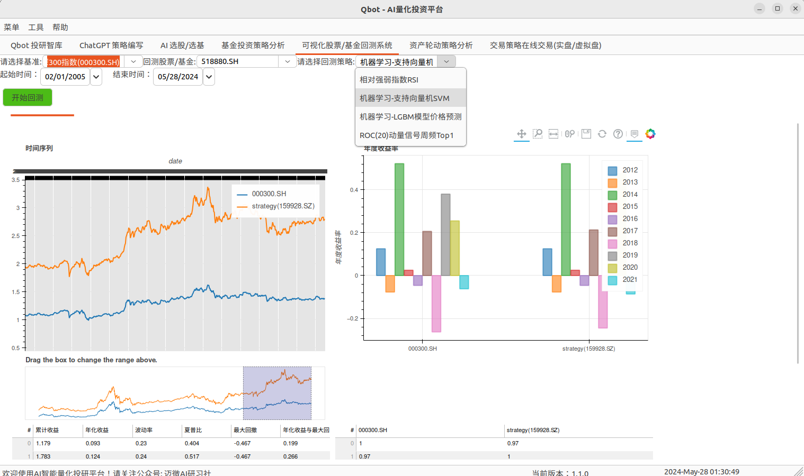</img>
            </div>
        </td>
        <td>
            <div class="mdl-cell mdl-cell--4-col">
                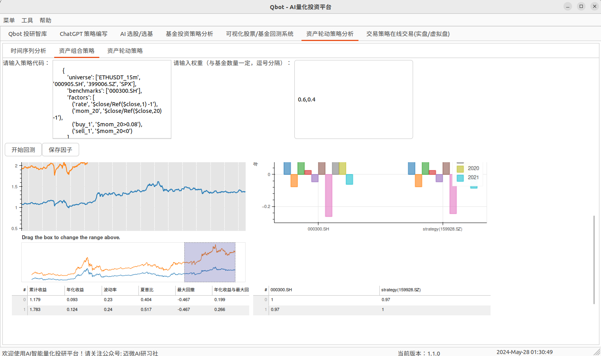
            </div>
        </td>
        <td>
            <div class="mdl-cell mdl-cell--4-col">
                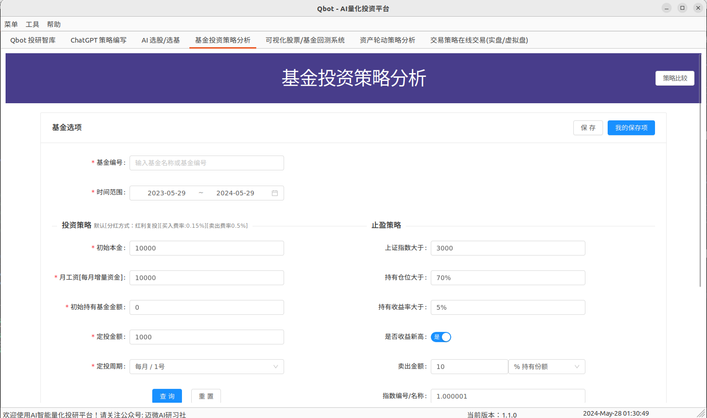
            </div>
        </td>
    </tr>
    <tr>
        <td>
            <div class="mdl-cell mdl-cell--4-col">
                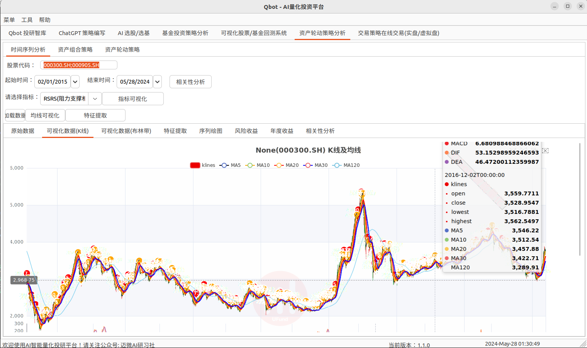
            </div>
        </td>
        <td>
            <div class="mdl-cell mdl-cell--4-col">
                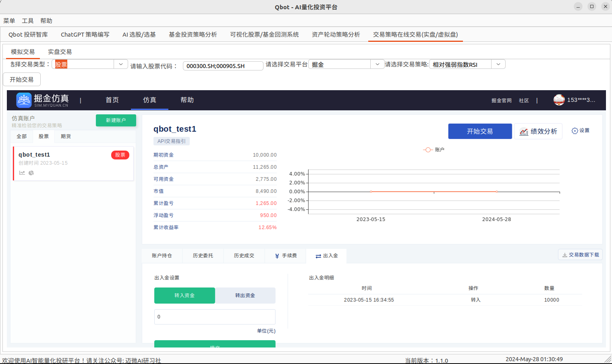
            </div>
        </td>
        <td>
            <div class="mdl-cell mdl-cell--4-col">
                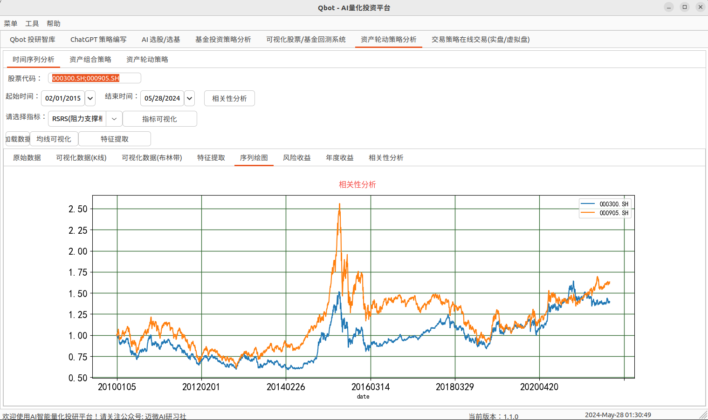
            </div>
        </td>
    </tr>
    </tbody>
</table>

<table class="table table-striped table-bordered table-vcenter">
    <tbody class=ai-notebooks-table-content>
    <tr>
        <td colspan="3" rowspan="1" class="ai-notebooks-table-points ai-orange-link">
            <div class="features-2 mdl-grid">
                <h2 style="text-align:center">2. 人工智能交易策略、自动化因子挖掘</h2>
                <p>机器学习、强化学习、深度学习策略开发，因子挖掘自动化workflow</p>
            </div>
        </td>
    </tr>
    <tr>
        <td>
            <div class="mdl-cell mdl-cell--4-col">
                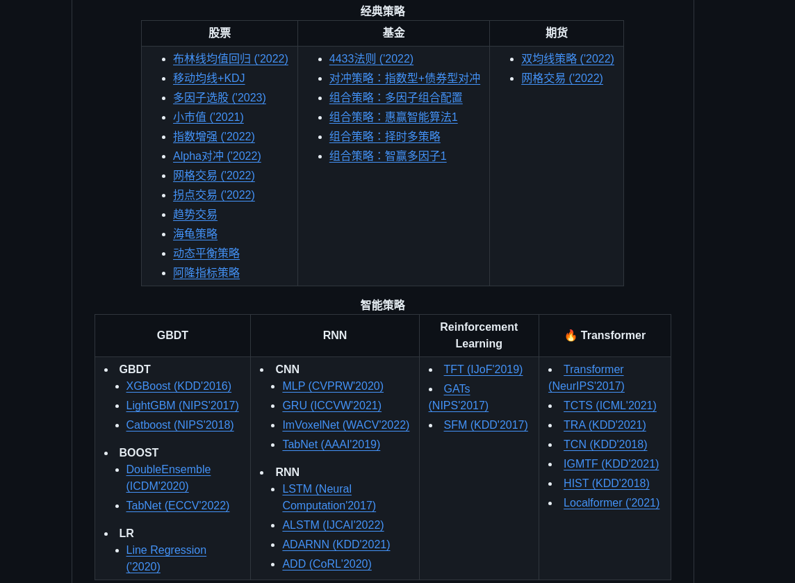</img>
            </div>
        </td>
        <td>
            <div class="mdl-cell mdl-cell--4-col">
                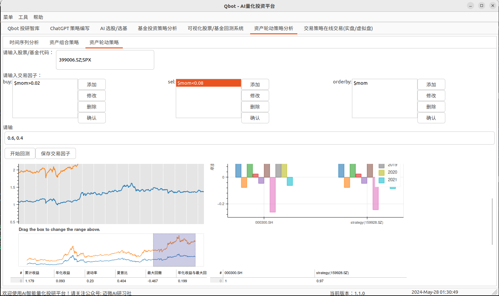
            </div>
        </td>
        <td>
            <div class="mdl-cell mdl-cell--4-col">
                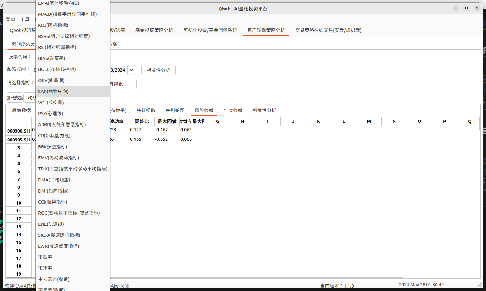
            </div>
        </td>
    </tr>
    </tbody>
</table>

<table class="table table-striped table-bordered table-vcenter">
    <tbody class=ai-notebooks-table-content>
    <tr>
        <td colspan="3" rowspan="1" class="ai-notebooks-table-points ai-orange-link">
            <div class="features-2 mdl-grid">
                <h2 style="text-align:center">3. 多种交易方式：在线回测 + 模拟交易 + 实盘自动化交易</h2>
                <p>以策略研究为目标，提供多种交易方式验证策略和提高收益。</p>
            </div>
        </td>
    </tr>
    <tr>
        <td>
            <div class="mdl-cell mdl-cell--4-col">
                </img>
            </div>
        </td>
        <td>
            <div class="mdl-cell mdl-cell--4-col">
                
            </div>
        </td>
        <td>
            <div class="mdl-cell mdl-cell--4-col">
                
            </div>
        </td>
    </tr>
    </tbody>
</table>

<table class="table table-striped table-bordered table-vcenter">
    <tbody class=ai-notebooks-table-content>
    <tr>
        <td colspan="3" rowspan="1" class="ai-notebooks-table-points ai-orange-link">
            <div class="features-2 mdl-grid">
                <h2 style="text-align:center">4. 多种提示方式：邮件 + 飞书 + 弹窗 + 微信</h2>
                <p>这是qbot的消息提示模块，多种方式提示交易信息：交易买卖信息、每日交易收益结果、股票每日推荐等。</p>
            </div>
        </td>
    </tr>
    <tr>
        <td>
            <div class="mdl-cell mdl-cell--4-col">
                </img>
            </div>
        </td>
        <td>
            <div class="mdl-cell mdl-cell--4-col">
                
            </div>
        </td>
        <td>
            <div class="mdl-cell mdl-cell--4-col">
                
            </div>
        </td>
    </tr>
    </tbody>
</table>

## Strategy pool

通过Qbot 可以积木式完成策略编写、多因子挖掘，实现数据开发、因子开发、组合优化、交易执行的[量化交易全流程](docs/01-新手指引/量化策略的分类和原理.md#1量化选股策略)。

<b>如果说策略是量化的核心 ，那么因子就是策略的核心。</b>通过Qbot量化投研平台研究员可实现自动化因子挖掘，提取出具备预测能力的单因子，利用历史数据进行回测，如果回测结果显示该因子的预测能力达标，就提交到因子库。然后，对因子库里的因子进行有机组合，以形成预测模型，预测模型是整个量化策略的目标。

以下即为，<u>数据指标单因子或组合因子</u>和<u>通过深度学习、机器学习、强化学习挖掘到的交易因子</u>，然后通过组合优化算法实现趋势交易、风险策略、alpha策略、动量轮动等等交易策略。

策略库源代码路径：[qbot/strategy](qbot/strategy)


<div align="center">
  <b>经典策略</b>
</div>
<table align="center">
  <tbody>
    <tr align="center" valign="bottom">
      <td>
        <b>交易对象</b>
      </td>
      <td>
        <b>选股</b>
      </td>
      <td>
        <b>择时</b>
      </td>
      <td>
        <b>风险控制 (组合、仓位管理)</b>
      </td>
    </tr>
    <tr valign="top">
      <td>
        <b>股票/期货/虚拟货币</b>
      </td>
      <td>
        <ul>
          <li><a href="docs/02-经典策略/01-股票/布林线均值回归.md">布林线均值回归 ('2022)</a></li>
          <li><a href="docs/tutorials_code/05.kdj_macd_in_A_market">移动均线+KDJ</a></li>
          <li><a href="qbot/strategy/bigger_than_ema_bt.py">简单移动均线</a></li>
          <li><a href="qbot/strategy/arbr_strategy.py">情绪指标ARBR</a></li>
          <li><a href="qbot/strategy/aroon_strategy.py">阿隆指标(趋势交易)</a></li>
          <li><a href="qbot/strategy/lgb_strategy.py">LightGBM 预测</a></li>
          <li><a href="qbot/strategy/svm_strategy.py">SVM 预测</a></li>
          <li><a href="qbot/strategy/lstm_strategy_bt.py">LSTM时序预测</a></li>
          <li><a href="qbot/strategy/rl_strategy_bt.py">强化学习预测</a></li>
          <li><a href="qbot/strategy/q-learning.py">Q-Leaning预测</a></li>
          <li><a href="docs/tutorials_code/11_RandomForest">随机森林预测</a></li>
          <li><a href="qbot/strategy/rsi_departure_strategy.py">RSI背离策略</a></li>
          <li><a href="qbot/strategy/ssa_strategy_bt.py">麻雀优化算法SSA</a></li>
          <li><a href="qbot/strategy/stoch_rsi_strategy.py">随机相对强弱指数 StochRSI</a></li>
          <li><a href="docs/02-经典策略/01-股票/小市值.md">小市值 ('2021)</a></li>
          <li><a href="qbot/strategy/undervalued_stock_picking_strategy.py">市场低估值策略</a></li>
          <li><a href="docs/02-经典策略/01-股票/量化策略-RSRS择时.md">RSRS择时</a></li>
          <li><a href="docs/02-经典策略/01-股票/量化三-配对交易.md">配对交易</a></li>
        </ul>
      </td>
      <td>
        <li><b>传统指标（对应下方Qbot支持的指标 <a href="#交易指标因子">这里</a>）</b></li>
        <ul>
          <li><a href="docs/02-经典策略/01-股票/布林线均值回归.md">布林线均值回归 ('2022)</a></li>
          <li><a href="docs/tutorials_code/05.kdj_macd_in_A_market">移动均线+KDJ</a></li>
          <li><a href="qbot/strategy/bigger_than_ema_bt.py">简单移动均线</a></li>
          <li><a href="qbot/strategy/klines_bt.py">双均线策略 ('2022)</a></li>
          <li><a href="qbot/strategy/arbr_strategy.py">情绪指标ARBR</a></li>
          <li><a href="qbot/strategy/aroon_strategy.py">阿隆指标(趋势交易)</a></li>
          <li><a href="qbot/strategy/lgb_strategy.py">LightGBM 预测</a></li>
          <li><a href="qbot/strategy/svm_strategy.py">SVM 预测</a></li>
          <li><a href="qbot/strategy/lstm_strategy_bt.py">LSTM时序预测</a></li>
          <li><a href="qbot/strategy/rl_strategy_bt.py">强化学习预测</a></li>
          <li><a href="qbot/strategy/q-learning.py">Q-Leaning预测</a></li>
          <li><a href="docs/tutorials_code/11_RandomForest">随机森林预测</a></li>
          <li><a href="qbot/strategy/rsi_departure_strategy.py">RSI背离策略</a></li>
          <li><a href="qbot/strategy/ssa_strategy_bt.py">麻雀优化算法SSA</a></li>
          <li><a href="qbot/strategy/stoch_rsi_strategy.py">随机相对强弱指数 StochRSI</a></li>
        </ul>
        <li><b>因子组合</b></li>
        <ul>
          <li><a href="qbot/strategy/rsi_cci_strategy.py">RSI和CCI组合</a></li>
          <li><a href="qbot/strategy/adx_strategy.py">MACD和ADX指标</a></li>
          <li><a href="docs/tutorials_code/05.kdj_macd_in_A_market">MACD和KDJ指标</a></li>
          <li><a href="qbot/strategy/multi_strategy_bt.py">多因子交易</a></li>
          <li><a href="docs/tutorials_code/13.alphalens_factor_backtest">alphalens多因子交易</a></li>
          <li><a href="docs/tutorials_code/08.harami_in_A_market">多策略整合</a></li>
          <li><a href="docs/notebook/Kurtosis Portfolio.ipynb">组合策略</a></li>
          <li><a href="docs/02-经典策略/01-股票/指数增强.md">指数增强 ('2022)</a></li>
        </ul>
        <li><b>经典策略</b></li>
        <ul>
          <li><a href="docs/02-经典策略/01-股票/多因子选股.md">多因子选股 ('2023)</a></li>
          <li><a href="docs/02-经典策略/01-股票/指数增强.md">指数增强 ('2022)</a></li>
          <li><a href="docs/02-经典策略/01-股票/Alpha对冲.md">Alpha对冲 ('2022)</a></li>
          <li><a href="docs/02-经典策略/03-期货/网络交易.md">网格交易</a></li>
          <li><a href="docs/02-经典策略/03-期货/双均线策略.md">双均线策略 ('2022)</a></li>
          <li><a href="docs/03-智能策略/拐点交易.md">拐点交易 ('2022)</a></li>
          <li><a href="docs/03-智能策略/">趋势交易</a></li>
          <li><a href="docs/03-智能策略/">海龟策略</a></li>
          <li><a href="docs/03-智能策略/">动态平衡策略</a></li>
        </ul>
      </td>
      <td>
        <ul>
          <li><a href="docs/notebook/Kurtosis Portfolio.ipynb">Kurtosis Portfolio组合策略 ('2023)</a></li>
          <li><a href="docs/02-经典策略/01-股票/指数增强.md">指数增强 ('2022)</a></li>
          <li><a href="docs/02-经典策略/01-股票/Alpha对冲.md">Alpha对冲 ('2022)</a></li>
          <li><a href="docs/03-智能策略/">动态平衡策略</a></li>
          <li><a href="qbot/strategy/multi_factor_strategy.py">多因子自动组合策略</a></li>
        </ul>
      </td>
      <tr valign="top">
        <td>
          <b>基金</b>
        </td>
        <td>
          <ul>
            <li><a href="docs/02-经典策略/02-基金/4433法则.md">4433法则 ('2022)</a></li>
          </ul>
        </td>
        <td>
          <ul>
            <li><a href="docs/02-经典策略/02-基金/">对冲策略：指数型+债券型对冲</a></li>
            <li><a href="docs/02-经典策略/02-基金/">组合策略：多因子组合配置</a></li>
            <li><a href="docs/02-经典策略/02-基金/">组合策略：惠赢智能算法1</a></li>
            <li><a href="docs/02-经典策略/02-基金/">组合策略：择时多策略</a></li>
            <li><a href="docs/02-经典策略/02-基金/">组合策略：智赢多因子1</a></li>
          </ul>
        </td>
        <td>
          <b>同上</b>
        </td>
      </tr>
    </tr>
  </tbody>
</table>

<div align="center">
  <b>智能策略</b>
</div>
<table align="center">
  <tbody>
    <tr align="center" valign="middle">
      <td>
        <b>GBDT</b>
      </td>
      <td>
        <b>RNN</b>
      </td>
      <td>
        <b>Reinforcement Learning</b>
      </td>
      <td>
        <b>:fire: Transformer</b>
      </td>
      <td>
        <b>:fire: LLM</b>
      </td>
    </tr>
    <tr valign="top">
      <td>
        <li><b>GBDT</b></li>
        <ul>
            <li><a href="qbot/strategy/benchmarks/XGBoost">XGBoost (KDD'2016)</a></li>
            <li><a href="qbot/strategy/benchmarks/LightGBM">LightGBM (NIPS'2017)</a></li>
            <li><a href="qbot/strategy/benchmarks/CatBoost/">Catboost (NIPS'2018)</a></li>
        </ul>
        <li><b>BOOST</b></li>
        <ul>
            <li><a href="qbot/strategy/benchmarks/DoubleEnsemble/">DoubleEnsemble (ICDM'2020)</a></li>
            <li><a href="qbot/strategy/benchmarks/TabNet/">TabNet (ECCV'2022)</a></li>
        </ul>
        <li><b>LR</b></li>
        <ul>
            <li><a href="qbot/strategy/benchmarks/Linear"> Line Regression ('2020)</a></li>
        </ul>
      </td>
      <td>
        <li><b>CNN</b></li>
        <ul>
          <li><a href="qbot/strategy/benchmarks/MLP">MLP (CVPRW'2020)</a></li>
          <li><a href="qbot/strategy/benchmarks/GRU/">GRU (ICCVW'2021)</a></li>
          <li><a href="qbot/strategy/benchmarks/">ImVoxelNet (WACV'2022)</a></li>
          <li><a href="qbot/strategy/benchmarks/TabNet/">TabNet (AAAI'2019)</a></li>
        </ul>
        <li><b>RNN</b></li>
        <ul>
          <li><a href="qbot/strategy/benchmarks/LSTM">LSTM (Neural Computation'2017)</a></li>
          <li><a href="qbot/strategy/benchmarks/ALSTM/">ALSTM (IJCAI'2022)</a></li>
          <li><a href="qbot/strategy/benchmarks/ADARNN/">ADARNN (KDD'2021)</a></li>
          <li><a href="qbot/strategy/benchmarks/ADD/">ADD (CoRL'2020)</a></li>
          <li><a href="qbot/strategy/benchmarks/KRNN/">KRNN ()</a></li>
          <li><a href="qbot/strategy/benchmarks/Sandwich/">Sandwich ()</a></li>
        </ul>
      </td>
      <td>
          <li><a href="qbot/strategy/benchmarks/TFT">TFT (IJoF'2019)</a></li>
          <li><a href="qbot/strategy/benchmarks/GATs/">GATs (NIPS'2017)</a></li>
          <li><a href="qbot/strategy/benchmarks/SFM/">SFM (KDD'2017)</a></li>
      </td>
      <td>
          <li><a href="qbot/strategy/benchmarks/Transformer">Transformer (NeurIPS'2017)</a></li>
          <li><a href="qbot/strategy/benchmarks/TCTS">TCTS (ICML'2021)</a></li>
          <li><a href="qbot/strategy/benchmarks/TRA">TRA (KDD'2021)</a></li>
          <li><a href="qbot/strategy/benchmarks/TCN">TCN (KDD'2018)</a></li>
          <li><a href="qbot/strategy/benchmarks/IGMTF">IGMTF (KDD'2021)</a></li>
          <li><a href="qbot/strategy/benchmarks/HIST">HIST (KDD'2018)</a></li>
          <li><a href="qbot/strategy/benchmarks/Localformer">Localformer ('2021)</a></li>
      </td>
      <td>
          <li><a href="https://chat-gpt-next-web-five-puce-64.vercel.app/">ChatGPT</a></li>
          <li><a href="https://github.com/UFund-Me/FinGPT">FinGPT</a></li>
      </td>
    </tr>
</td>
    </tr>
  </tbody>
</table>

### Benchmark and Model zoo

Results and models are available in the [model zoo](docs/03-智能策略/model_zoo.md). AI strategies is shown at [here](./pytrader/strategies/), local run ``python backend/pytrader/strategies/workflow_by_code.py``, also provide [](https://mybinder.org/v2/gh/UFund-Me/Qbot/blob/main/backend/pytrader/strategies/workflow_by_code.ipynb/HEAD)

<details><summary><em><b>👉 点击展开查看具体AI模型benchmark结果</b></em></summary>

|                | status | benchmark |   framework  | DGCNN | RegNetX | addition |   arXiv    |
|  :-----------: | :----: | :--------:|   :----:     | :---: | :-----: | :------: | :--------: |
|     GBDT       |   ✗    |     ✗     |   XGBoost    |   ✗   |    ✗    |  Tianqi Chen, et al. KDD 2016 |     ✗      |
|     GBDT       |   ✗    |     ✗     |   LightGBM   |   ✗   |    ✓    |  Guolin Ke, et al. NIPS 2017 |     ✗      |
|     GBDT       |   ✗    |     ✗     |   Catboost   |   ✗   |    ✓    |  Liudmila Prokhorenkova, et al. NIPS 2018 |     ✗      |
|     MLP        |   ✓    |     ✓     |   pytorch    |   ✗   |    ✗    |  --      |     ✗      |
|     LSTM       |   ✓    |     ✓     |   pytorch    |   ✗   |    ✗    |  Sepp Hochreiter, et al. Neural computation 1997 |  ✗  |
|    LightGBM    |   ✓    |     ✓     |   pytorch    |   ✗   |    ✗    |  --      |     ✗      |
|     GRU        |   ✓    |     ✗     |   pytorch    |   ✗   |    ✗    |  Kyunghyun Cho, et al. 2014 |     ✗      |
|     ALSTM      |   ✗    |     ✗     |   pytorch    |   ✗   |    ✗    |  Yao Qin, et al. IJCAI 2017 |     ✗      |
|     GATs       |   ✗    |     ✓     |   pytorch    |   ✗   |    ✗    |  Petar Velickovic, et al. 2017 |     ✗      |
|     SFM        |   ✓    |     ✓     |   pytorch    |   ✗   |    ✗    |  Liheng Zhang, et al. KDD 2017 |     ✗      |
|     TFT        |   ✓    |     ✓     |   tensorflow |   ✗   |    ✗    |  Bryan Lim, et al. International Journal of Forecasting 2019 | ✗ |
|     TabNet     |   ✓    |     ✗     |   pytorch    |   ✗   |    ✗    |  Sercan O. Arik, et al. AAAI 2019 |     ✗      |
| DoubleEnsemble |   ✓    |     ✓     |   LightGBM   |   ✗   |    ✗    |  Chuheng Zhang, et al. ICDM 2020 |     ✗      |
|     TCTS       |   ✓    |     ✗     |   pytorch    |   ✗   |    ✗    |  Xueqing Wu, et al. ICML 2021 |     ✗      |
|  Transformer   |   ✓    |     ✗     |   pytorch    |   ✗   |    ✗    |  Ashish Vaswani, et al. NeurIPS 2017 |     ✗      |
|  Localformer   |   ✓    |     ✗     |   pytorch    |   ✗   |    ✗    |  Juyong Jiang, et al. |     ✗      |
|     TRA        |   ✓    |     ✗     |   pytorch    |   ✗   |    ✗    |  Hengxu, Dong, et al. KDD 2021 |     ✗      |
|     TCN        |   ✓    |     ✗     |   pytorch    |   ✗   |    ✗    |  Shaojie Bai, et al. 2018 |     ✗      |
|     ADARNN     |   ✓    |     ✗     |   pytorch    |   ✗   |    ✗    |  YunTao Du, et al. 2021 |     ✗      |
|     ADD        |   ✓    |     ✗     |   pytorch    |   ✗   |    ✗    |  Hongshun Tang, et al.2020 |     ✗      |
|     IGMTF      |   ✓    |     ✗     |   pytorch    |   ✗   |    ✗    |  Wentao Xu, et al.2021 |     ✗      |
|     HIST       |   ✓    |     ✗     |   pytorch    |   ✗   |    ✗    |  Wentao Xu, et al.2021 |     ✗      |


<sup>**Note:** All the about **300+ models, methods of 40+ papers** in quant.ai supported by [Model Zoo](./docs/03-智能策略/model_zoo.md) can be trained or used in this codebase.</sup>

</details>

<br>

### 交易指标/因子

包含但不限于alpha-101、alpha-191，以及基于deap实现的因子自动生成算法。
```
EMA(简单移动均线)
MACD(指数平滑异同平均线)
KDJ(随机指标)
RSRS(阻力支撑相对强度)
RSI(相对强弱指标)
StochRSI(随机相对强弱指数)
BIAS(乖离率)
BOLL(布林线指标)
OBV(能量潮)
SAR(抛物转向)
VOL(成交量)
PSY(心理线)
ARBR(人气和意愿指标)
CR(带状能力线)
BBI(多空指标)
EMV(简易波动指标)
TRIX(三重指数平滑移动平均指标)
DMA(平均线差)
DMI(趋向指标)
CCI(顺势指标)
ROC(变动速率指标, 威廉指标)
ENE(轨道线)  # 轨道线（ENE）由上轨线(UPPER)和下轨线(LOWER)及中轨线(ENE)组成，
            # 轨道线的优势在于其不仅具有趋势轨道的研判分析作用，也可以敏锐的觉察股价运行过程中方向的改变
SKDJ(慢速随机指标)
LWR(慢速威廉指标)  # 趋势判断指标
市盈率
市净率
主力意愿(收费)
买卖差(收费)
散户线(收费)
分时博弈(收费)
买卖力道(收费)
行情趋势(收费)
MTM(动量轮动指标)(收费)
MACD智能参数(收费)
KDJ智能参数(收费)
RSI智能参数(收费)
WR智能参数(收费)
Qbot智能预测(收费)
Qbot买卖强弱指标(收费)
```

<br>

## 支持的实盘交易接口

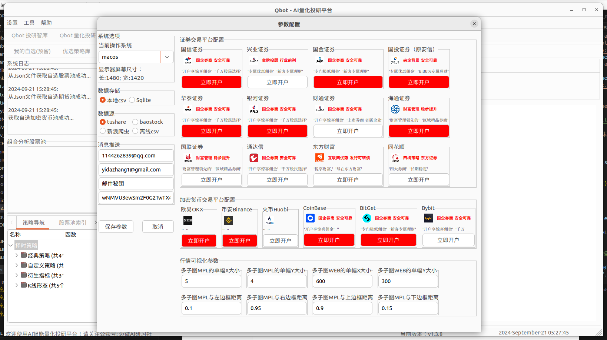</img>

------

[证券平台账号开通](qbot/engine/trade/engine_apis/venv/README.md) 

低费率开户：股票万0.854免五, ETF万0.4, 可转债万0.4 没有资金门槛。关注公众号可开户

另外提供开通券商量化交易接口，支持python编写实盘交易

支持股票券商
- 海通客户端(海通网上交易系统独立委托)
- 华泰客户端(网上交易系统（专业版Ⅱ）)
- 国金客户端(全能行证券交易终端PC版)
- 其他券商通用同花顺客户端(需要手动登陆)


<b>开通方式<b>：微信Yida_Zhang2 (注明：开户)
------

### 实盘交易接口
> 欢迎更多交易所、柜台开放交易api

- 期货
  - CTP
  - CTPMini
  - 飞马Femas
  - 艾克朗科（仅组播行情）
  - 易达
- 期权
  - CTPOpt
  - 金证期权maOpt
  - QWIN二开
- 股票
  - 中泰XTP
  - 中泰XTPXAlgo
  - 华鑫奇点
  - 华锐ATP
  - 宽睿OES
  - 同花顺
  - 东方财富
  - 华泰证券
  - 国泰君安
  - 中汇亿达
  - 恒生UFT
  - 掘金
  - 顶点飞创
  - 华鑫奇点
  - 通达信
- 虚拟货币/数字货币
  - 欧易OKEX
  - 币安Bianace
  - 火币Huobi

### 仿真交易接口/平台

| API  |  交易类型  |  操作系统   |
| ---- |    ---    |       --- |
| qbot_pro | 股票、期货、基金、虚拟货币 | Win、Linux、Mac|
| [掘金仿真](https://sim.myquant.cn/sim/help/#%E4%B8%8B%E8%BD%BD%E4%BA%A4%E6%98%93sdk)  | 股票、基金、期货 | Win、Linux、Mac |
| 极星量化  | 期货 | Win、Mac |
| WonderTrader | 股票、期货 | Win、Linux |
| TradingView | 虚拟货币 | Win、Linux、Mac|
| 欧易OKEX、币安 Binance 、火币huobi | 虚拟货币 | Win、Linux、Mac|

## 加密货币交易所注册推荐码

- OKEX 交易所注册推荐码, 手续费返佣 **20%**
  - https://www.cnouyi.social/join/57246734

- 币安交易所注册推荐码, 手续费返佣 **10%**
  - https://accounts.binance.com/register?ref=130173909

- 火币交易所注册推荐码, 手续费返佣 **15%** (推荐)
  - https://www.htx.com/invite/zh-cn/1f?invite_code=wr938223

### 为什么选择币安交易所

交易的手续费看起来很少，但是随着交易次数逐步增多，手续费也是一笔不小的开支。
所以我选择了币安，手续费低的大平台交易所
> 火币手续费 Maker 0.2% Taker 0.2%

> 币安手续费 Maker 0.1% Taker 0.1% （加上BNB家持手续费低至0.075%）

如果你还没有币安账号：[注册页面](https://accounts.binance.com/en-NG/register?ref=130173909)（通过链接注册，享受交易返现优惠政策）


## 开源共创、社区共建

首先，感谢自今年5月份开源以来收到广大用户的关注！我们在基础版本中开放了很多传统量化策略、深度学习、强化学习等人工智能策略和多因子库，为此，我们发起《Qbot人工智能量化交易社区共建计划》。采取以下两种方式共建共赢：

1. 内容共建：

- 在我们免费提供的<b>人工智能交易策略</b>基础上，提高SOTA指标，然后以个人所有权提交Qbot量化交易社区，作为一种策略服务提供给更多人，获取收益；
- 在我们免费提供的<b>上千个交易因子</b>基础上，应用交易因子完成策略回测、模拟交易，对交易结果好的可作为一种交易策略服务提供给更多人，获取收益；

2. 代码贡献：

- 参与本代码仓库程序设计与实现，多提交PR合并后可免费加入知识星球；
- 贡献榜单前10名可获得一年免费使用权，前3名可获得qbot进阶版终身免费使用权；

## Qbot 版本说明

| 版本介绍 | 说明 | 产品与服务 | 适合人群 |
| --- | --- | --- | --- |
| public（开源版） | 当前开源仓库 | - 开源代码可自行学习，提供整个框架的闭环搭建，实现数据的获取、策略开发、指标分析等功能 | 对量化交易感兴趣的开发者、产品经理 |
| pro(专业版) | 专业付费版（年费，更新代码）  | <br />- 量化交易智库（研报复现、前沿策略探索、投研资讯））<br />- qbot_pro 包含基础版本的所有功能，并且实现AI选股、数据获取清洗、策略开发、策略回测、模拟交易、实盘自动化交易全流程闭环<br />- 封装好的接口示例、系统源码开发示例<br />- 易于开发的策略模板和因子表达式<br />- 分层架构设计，数据、策略(回测、实盘交易)中间表达。<br />- 社群答疑服务<br />- 遵循《署名-非商业性使用-相同方式共享》开放协议的其他非商业用途的二次开发<br /> | <br />- 个人量化交易员、证券交易从业者<br />- 希望快速学习量化并在股票、基金、虚拟货币实现量化交易的<br /> |
| vip   | 1对1的会员专项服务（年费，每年更新代码） | <br /><br />- 最新的量化交易系统，包含基础版本和专业版的所有软件功能 <br />- 提供封装好的基金、股票、期货、及现货和合约量化接口 （支持Binance现货、合约） <br />-  多个智能量化策略示例 <br />-  远程技术支持和服务 <br /> | <br />- 量化交易员<br />- 希望快速学习量化并在相关市场实现量化交易的<br />- 定制相关市场接口<br /> |

> [!TIP]
> 相关软件版本付费及更多信息、答疑解惑，添加微信 Yida_Zhang2

## 策略原理及源码分析

本项目编写了详细的策略原理说明和平台搭建到使用的详细文档，尤其适合量化小白。欢迎加群交流！

[在线文档](https://ufund-me.github.io/Qbot/#/) | [❓ 常见问题](https://ufund-me.github.io/Qbot/#/04-%E5%B8%B8%E8%A7%81%E9%97%AE%E9%A2%98/FQA) | [Jupyter Notebook](./backend/pytrader/strategies/notebook)

## Quantstats Report


Click [HERE](backend/quantstats#visualize-stock-performance) to more detail.

### Some strategy backtest results:

> 声明：别轻易用于实盘，市场有风险，投资需谨慎。

```
symbol：华正新材(603186)
Starting Portfolio Value: 10000.00
Startdate=datetime.datetime(2010, 1, 1),
Enddate=datetime.datetime(2020, 4, 21),
# 设置佣金为0.001, 除以100去掉%号
cerebro.broker.setcommission(commission=0.001)
```
    
A股回测MACD策略:


👉 点击[查看](docs/tutorials_code/02.easy_macd_strategy/macd.py)源码

A股回测KDJ策略:

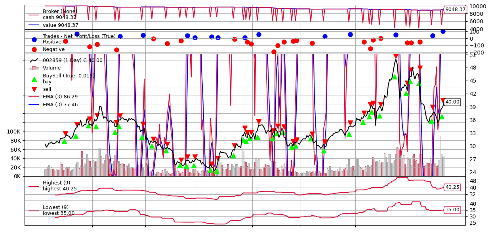
    


👉 点击[查看](docs/tutorials_code/04.kdj_with_macd/kdj.py)源码

A股回测 KDJ+MACD 策略:

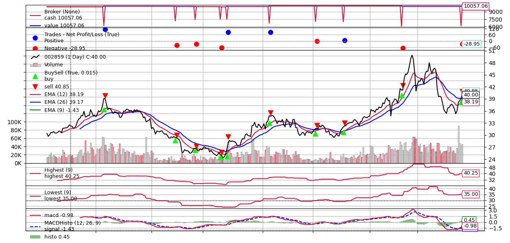


👉 点击[查看](docs/tutorials_code/04.kdj_with_macd/kdj_macd.py)源码

## TODO

👆 右上角点击  告诉我，你希望这个项目继续加速开发迭代[ ❤️ & ☕️](https://github.com/sponsors/Charmve)

- [x] 把策略回测整合在一个上位机中，包括：选基、选股策略、交易策略，模拟交易，实盘交易
- [ ] 很多策略需要做回测验证；
- [ ] 本项目由前后端支持，有上位机app支持，但目前框架还比较乱，需要做调整；
- [ ] 各种策略需要抽象设计，支持统一调用；
- [ ] 增强数据获取的实时性，每秒数据，降低延迟；
- [ ] 在线文档的完善，目前主要几个部分：新手使用指引、经典策略原理和源码、智能策略原理和源码、常见问题等；
- [ ] 新的feature开发，欢迎在[issues](https://github.com/UFund-Me/Qbot/issues/)交流；

### No-code operation


体验下来，dagster是很适合金融数据采集、处理，还有机器学习的场景。当然这里的场景更偏向于“批处理”，“定时任务”的处理与编排。

```
cd plugins/dagster
dagster-daemon run &
dagit -h 0.0.0.0 -p 3000
```

## Contributing

We appreciate all contributions to improve Qbot. Please refer to [CONTRIBUTING.md](.github/CONTRIBUTING.md) for the contributing guideline.

<table>
    <tr>
        <td align="center">
          <a target="_bank" href="https://github.com/Charmve">
            
            <div><sub><b>Charmve</b></sub></div>
          </a>
        </td>
    </tr>
</table>

## 🍮 Community
- Github <a href="https://github.com/UFund-Me/Qbot/discussions" target="_blank">discussions 💬</a> or <a href="https://github.com/UFund-Me/Qbot/issues" target="_blank">issues 💭</a>

- 微信: Yida_Zhang2
- Email: yidazhang1#gmail.com 
- 知乎/小红书：[@Charmve](https://www.zhihu.com/people/MaiweiE-com) | [@Charmve](https://www.xiaohongshu.com/user/profile/5f0a6ef9000000000100104a?xhsshare=CopyLink&appuid=5f0a6ef9000000000100104a&apptime=1725162795&share_id=2e375d139cbb494eba7f42de4cf15bae)
<br>

- 知识星球：AI量化投研实验室 （加我微信，邀请）
  - 本星球为VIP付费社群，对于购买Pro版本的用户，可免费加入。拓展人脉，及时获取研报和论文解读与源代码实现，多种投顾服务。

<br>

<table class="table table-striped table-bordered table-vcenter">
    <tbody class=ai-notebooks-table-content>
    <tr>
        <td width=33%>
            <div class="mdl-cell mdl-cell--4-col">
                <a href="https://github.com/UFund-Me/.github/assets/29084184/c8782e38-be7d-4839-bad0-6736bfb9ab9e"></img></a> <br>个人微信
            </div>
        </td>
        <td width=33%>
            <div class="mdl-cell mdl-cell--4-col">
                <a href="https://github.com/UFund-Me/.github/assets/29084184/712a460f-a264-4f16-a7b8-c990106ec624"></a> <br>Qbot用户微信交流群
            </div>
        </td>
        <td width=33%>
            <div class="mdl-cell mdl-cell--4-col">
                <a href="https://github.com/UFund-Me/.github/assets/29084184/9d3983ff-ece8-4f99-8579-94234987dcf2"></a> <br> <sup>AI量化交易策略分享、实盘交易教程、实时数据接口</sup> <br>知识星球（付费）
            </div>
        </td>
    </tr>
    </tbody>
</table>

若二维码因 Github 网络无法打开，请点击[二维码](https://charmve.github.io/img/contact-card.png)直接打开图片。

<br>

<table align="center"><tbody>
  <tr>
    <td colspan="2" rowspan="1">
      <h4>🎉 本项目刚上线就收到了两次GitHub官方趋势榜Top5、Top1好成绩! </h4>
      <p>现对于转发本项目到朋友圈或100人以上微信群等，可获得<b>知识星球价值20元的 🎫优惠券 一张</b>, 限时10张。</p>
    </td>
  </tr>
  <tr>
    <td colspan="1" rowspan="5" class="ai-notebooks-table-points ai-orange-link">
        <div align="center">
            <a href="https://github.com/UFund-Me/Qbot" target="_blank"></a>&nbsp;
            <a class="https://github.com/UFund-Me/Qbot">
              
            </a>&nbsp;
            <a href="https://raw.githubusercontent.com/UFund-Me/Qbot/main/gui/imgs/wechat.png" target="_blank"></a>
            <p>🔥Among the <a href="https://github.com/topics/quant-trade" target="_blank">top 10</a> Quant &amp; Trade repos on GitHub</p>
        </div>
        <ul> 主要包含两部分：在本项目的基础下，
            <li>增加更多策略研究，包含回测源码（请先学会有本项目中的策略库）；</li>
            <li>增加实盘接入方式的源代码；</li>
            <li>策略交流，AI投研实验室MeetUp线上/线下活动（对于基础薄弱的同学，欢迎进微信群答疑）</li>
            <li>最近较为受欢迎的一个福利点：AI选股推荐列表邮件订阅，这有个样例 https://github.com/UFund-Me/Qbot/issues/37</li>
        </ul>
      </td>
      <td>
        
      </td>
</tr></tbody></table>

<br>

## :warning: Disclaimer

👨‍🏫 **重点重点！** 交易策略和自动化工具只是提供便利，并不代表实际交易收益。该项目任何内容不构成任何投资建议。市场有风险，投资需谨慎。

## 🔥 Stargazers Over Time
	
<!-- [](https://starchart.cc/UFund-Me/Qbot) -->

[](https://star-history.com/#UFund-Me/Qbot&ailabx/ailabx&jadepeng/pytrader&Timeline)
    
## Sponsors & support

If you like the project, you can become a sponsor at [Open Collective](https://opencollective.com/qbot) or use [GitHub Sponsors](https://github.com/sponsors/Charmve).

<b>Thank you for supporting Qbot!</b>

<a href="https://opencollective.com/qbot" target="_blank"></a>
<a href="https://opencollective.com/qbot#category-CONTRIBUTE" target="_blank"></a>


## LICENSE


署名-非商业性使用-相同方式共享 4.0 国际

<br>

<a href=""></a>

## ♥️ Acknowledgements

<b>Last but not least, we're thankful to these open-source repo for sharing their services for free:</b>

基于 backtrader、[vnpy](https://github.com/vnpy/vnpy)、[qlib](https://github.com/microsoft/qlib)、tushare、easyquant、[fund-strategies](https://github.com/SunshowerC/fund-strategy)、[investool](https://github.com/axiaoxin-com/investool) 等开源项目，感谢开发者。

<br><br>

感谢大家的支持与喜欢！

Code with ❤️ & ☕️ @Charmve 2022-2023
