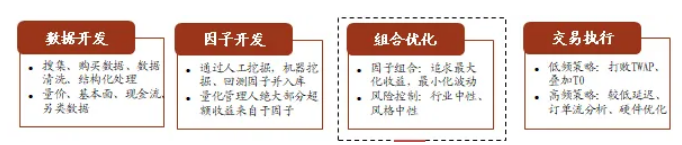
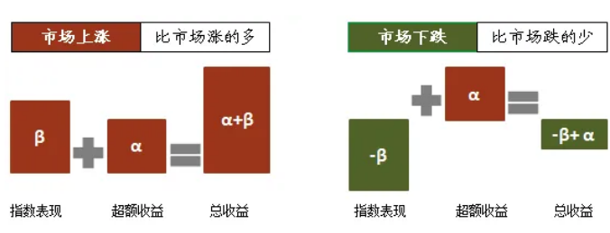
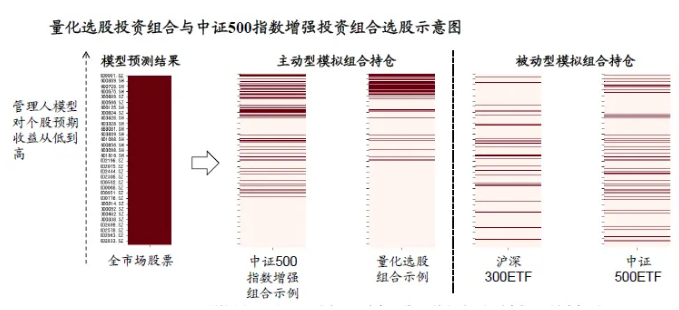
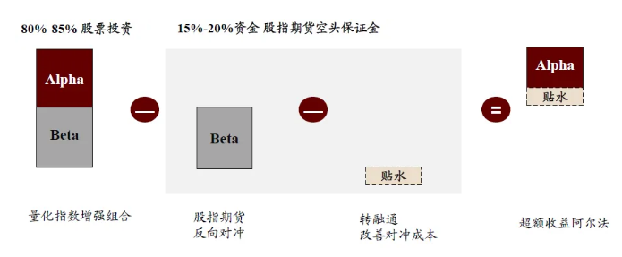
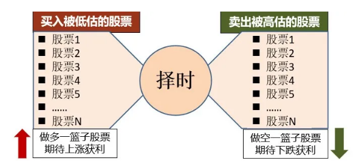
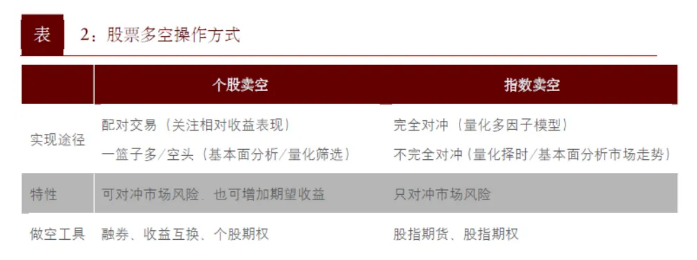

量化策略的分类和原理

> 引用自：https://mp.weixin.qq.com/s/hf5f2ijRwJhki9Y869fCZg

量化，是把主观的思维，通过数理的方法，进行定量、系统的实现过程。

策略，是可能实现目标的方案集合。

量化策略，是指区别于主观的定性分析，通过数理的方法，以及数据统计和机器决策，来进行证券投资与交易。

具体来说，量化策略就是在选股、择时、交易、仓位管理、止盈止损等各个环节，都以数理模型和计算机为工具，进行量化的分析、决策和交易。

我们可以通过与主观策略进行对比，来加深对量化策略的了解。主观策略有这样几个特点：

1、选股依据主观判断；

2、持仓较为集中；

3、需要分析师对市场进行分析之后，再形成交易决策；

4、对于交易系统要求不高。

量化策略则有如下4个特点：

1、纪律性：选股过程有标准化的方案和流程，还可以克服贪婪、恐惧、情绪波动等人性的弱点；

2、分散化：全市场选股，持仓标的非常分散，少则300只，多则2000只股票。根本的方法论是通过计算概率来获取收益；

3、及时性：实时跟踪市场变化，发现定价错误，就及时触发指令、迅速交易，市场风格发生转换就及时调整参数；

4、系统性：可以从大类资产、细分行业、宏观周期等多维度、多角度来进行投研和配置，在交易环节，则会构建完整的自动化买入和卖出交易系统。

这里顺带解释一下交易系统，从券商端看到的交易系统，相对狭义，主要在交易执行环节，就是委托提交、委托确认和成交回报这3个步骤，对应报盘系统的3张表（ashare_ordwth、ashare_ordwth2、ashare_cjhb），侧重于交易订单的执行。

而私募等机构的投研策略，或者说投资端视角的交易系统，则包含选股、择时、交易、风控、仓位管理、资金管理、止盈止损等诸多环节。

所以从全链条来看，完整闭环的交易系统，可分为4部分：策略系统（投研端）→订单生成系统（投研端或券商端）→订单执行系统（券商端）→交易撮合系统（交易所）。

其中订单生成系统的目标，是为了提高交易效率、降低交易成本，同时减少对市场的冲击、隐藏交易意图，以及捕捉交易机会，其核心就是用算法交易和组合交易（篮子委托）来做拆单。

订单生成的功能可以由券商端的PB交易系统来实现，也可以由投资端的策略系统来实现。

这里的算法交易，是一个专有名词（Algorithmic Trading—ALGO），用于交易执行。

前面的策略系统使用投资决策算法，以投资为目的。

后面的交易执行算法，或者叫算法交易，则以辅助投资和交易执行为目的，体现形式就是拆单，但如何拆单和下单，就衍生出各种算法交易。

算法交易分被动型和主动型两类，其中被动型算法交易最成熟，应用也最广。

被动型算法，是指按照一个既定的交易计划进行委托下单，比如主流的TWAP（时间加权平均价）在设定的时间段内均匀下单，VWAP（成交量加权平均）在设定的时间段内按照成交量的分布大小下单。

主动型算法交易，也叫机会型算法交易，比如主动型VWAP、狙击手（Sniper）、嗅探器（Sniffer）算法等，会根据市场状况作出实时决策，判断是否交易，以及交易的数量和价格。主动型算法除了要减少滑点（滑价），同时要预测价格趋势。

此外还有一些智能和综合算法，比如T0日内策略，根据智能信号，捕捉交易拐点，通过买卖、融资融券等方式，获取价差，当天交易完成后，持仓不变，赚取额外收益。

目前国内主动型算法主要由卡方、金纳、丽海弘金、迅投、泰铼等第三方算法交易服务商提供，头部券商正在加大科技投入，券商自研算法交易未来有望重回主导。

而订单执行系统，就是券商的核心交易系统，主要提供交易通道和报盘席位（PBU），如金证恒生等提供的集中交易柜台，包含账户、股份、资金、交易、报盘、清算、外围及三方存管等管理模块。

私募机构使用的PB交易客户端，个人投资者使用的同花顺、通达信PC端和手机APP，都属于集中交易系统的外围委托方式。

近年来，随着量化投资的兴起，传统集中交易柜台已经难以满足量化策略的速度和性能要求，国内券商纷纷采购或自研极速柜台系统，采用独立的高速线路和独立的报盘网关，并在硬件、网络、系统等层面展开军备竞赛。

一般来说，价投类多头策略会使用功能齐全的PB交易端，而量化类策略则使用速度和性能更佳的极速交易柜台。

对于私募等机构来说，投研及策略系统是核心，后面的部分都是执行。

私募除投研之外的业务，如产品设计、注册备案、产品募资、资产托管、研究支持、杠杆融资、证券拆借、交易执行、清算估值、后台运营等全部外包给证券公司。

这一揽子外包服务，就组成了券商的PB（Prime Brokerage主经纪商）业务，可以算得上公募全业务与私募核心业务之间的补集。

总体来说，策略系统更侧重于投资分析的算法和模型，而订单执行和交易撮合系统则更侧重于性能和速度。

另外，AI人工智能虽然可以生成投资决策，但数据选择和模型调试还是需要专业投资人士的参与。

所以量化策略不能说没有人为和主观的成分，只是说相对于传统策略，量化策略主观的成分相对较少。

用一句话描述量化策略的本质，那就是定性投资的数量化实践。

## 一、量化策略的思想起源

量化策略的思想大致来源于4个方面：经典理论、逻辑推理、数据挖掘、机器学习。

哈里·马科维茨的现代资产组合理论（MPT）和威廉·夏普的资本资产定价模型（CAPM），是量化研究最核心的理论基础。

1952年，马科维茨在《金融》杂志上发表了《资产组合选择—投资的有效分散化》一文，标志着现代组合投资理论的开端。

在这篇论文里，马科维茨合理假设证券收益率服从正态分布，从而以均值、方差这两个数字特征，来定量描述单一证券的收益和风险。

这是经济学家第一次对风险和收益进行了精确定义，从那以后就有了CAPM——资本资产定价模型，以及一系列辅助投资的工具。

1990年，现代资产组合理论（MPT）的奠基者哈里·马克维茨，和资本资产定价模型（CAPM）的创始人威廉·夏普，共同获得了1990年的诺贝尔经济学奖。

经典CAPM这样定义：一个投资组合的期望收益可以分为2部分，α收益和β收益，投资收益率 = α收益 + β收益。

α收益为投资组合超越市场组合的超额收益，β收益为投资组合承担系统风险而获得的收益。

1976年，斯蒂芬·罗斯提出一个尝试替代CAPM的套利定价模型APT（Arbitrage Pricing Theory ），APT其实与套利交易无关，是适用于所有资产的估值模型。

该模型认为，资本资产的收益率是各种因素综合作用的结果，如GDP的增长、通货膨胀的水平等等，并不仅仅只受证券组合内部风险因素的影响。

除了MPT 、CAPM和APT这3个相对科学的理论基础，量化策略还借鉴了大量从20世纪初就开始流行的，诸如K线理论、道氏理论、江恩法则、趋势理论、形态理论、波浪理论、时间周期理论等传统技术分析的内容，作为多因子选股的部分指标。

所以，量化策略也需要以传统技术分析的3大假设为前提：一、市场行为包含一切信息；二、价格沿趋势移动；三、历史会重演。

在经典理论之外，量化策略更多依靠常规的逻辑推理，通过对宏观信息的量化处理，整理出符合宏观基本面信息的量化模型。如行业轮动量化策略、市场情绪轮动量化策略、上下游供需关系量化策略等。

而随着大数据技术近年来的高速发展，数据挖掘也被用于量化投资。金融投资是高度数字化的行业，历史的行情、资讯、财务和交易信息已经积淀了丰富的数据资源，非常适合大数据技术的应用。

数据挖掘技术可以通过对高维度的数据进行分析整理，把量化思路提升到应用层次，将一些隐藏在高维度数据中的规律信息挖掘出来，最终形成量化交易策略。

此外，跟大数据技术一同进化发展的机器学习，同样适合量化投资这类博弈领域。

机器学习是人工智能AI的核心，是使计算机具有智能的根本途径，而机器学习的核心则是学习和预测能力。

具体来说，就是借助于计算机，对数据（训练集）进行学习后，形成模式识别（模型），进而实现对未来数据（测试集）的预测。

## 二、国内量化策略的演变过程

国内量化策略的演变，大致分为4个阶段：

- 第1个阶段：量化酝酿期（2001—2010年），因为国内金融市场没有可以做空的机制，加上计算能力不足，可用数据较少，而且主要是量价类数据，因子的筛选和挖掘以人工为主，这个阶段，还处于量化的酝酿期；

- 第2个阶段：量化1.0萌芽期（2010—2015年），以2010年沪深300-IF股指期货上市为开端，因为有了对冲工具，量化投资开始发展，但这个时期国内量化策略都处于摸索阶段，量化产生的收益，很多来自于系统自身β（Beta）的上涨。

    2015年以前，国内主流的量化对冲策略，是利用沪深300股指期货进行对冲，而形成的市场中性和套利策略；

- 第3个阶段：量化2.0转型期（2015—2019年）,2015年中证500-IC以及上证50-IH股指期货上市，进一步丰富了做空机制，对冲工具从沪深300指数，转向以中证500指数为主。

而随着计算能力的提升，量化策略开始从传统的多因子模型，转向量价高频，开始获取真正的α（Alpha）；

- 第4个阶段：量化3.0发展期（2019年至今），2019年，跟科创板配套的公募基金转融通业务正式开启，两融标的也迎来大扩容，从950只增加到1600只，中证800成分股（沪深300+中证500）两融标的覆盖率也达到了95%。

券源供给大幅增加，使得国际主流的多空（Long/short）等策略更加完整。

与此同时，投资机构更加重视科技，机器学习获得大量应用，策略迭代更快，交易执行变得越来越重要。

## 三、量化策略的分类

量化策略的精确分类，并不容易，就像基金和理财产品，银行、券商、基金公司的分类各不相同，前中后台、不同层级的分类也不相同。

我们平时看到的量化策略，有的是基础策略，有的是组合策略，有的是产品策略，有的策略相互重叠，而海外与国内对量化策略的分类也有一些差异。

以海外来说，Eureka hedge将对冲基金策略分为：股票多空（Equity Long/short）、 多策略（Multi -strategy）、CTA（CTA/managed Futures）、事件驱动（Event-driven Strategy）、套利（Arbitrage）、固定收益（Fixed income）、全球宏观（Global Macro Strategy）、相对价值（Relative value）、不良债务投机性策略（Distressed debt）等。

国内的量化策略，如果按交易思想来分，可以分为3大基础策略：趋势性策略（Trend ）、相对价值策略（Relative Value）和事件驱动策略（Event Driven）：

| 基础策略 | 策略细分 | 策略简述  |
| --- | --- | --- | 
| 趋势性策略 |  股票多空 | 持有股票多头的同时，采用股票空头做风险对冲，选择股票标的的同时，对大盘多空进行择时，以动量策略为主。| 
| 趋势性策略 | 股票量化 | 采用量化多因子模型进行选股，并通过调整仓位来控制风险。|
| 趋势性策略 | 宏观对冲 | 通过预判宏观走势，投资于股票、债券、商品等多种资产。 |
| 趋势性策略 | 管理期货（CTA） | 通过期货、期权等衍生品进行投机或套利交易的策略。 |
| 相对价值 | 股票市场中性 | 通过多因子选股和股指期货对冲获取超越指数的收益。 |
| 相对价值 | 套利策略 | 从金融资产的错误定价中获利。 |
| 事件驱动 | 并购重组、定向增发、大宗交易、特殊事件等 | 挖掘可能造成特定上市公司股价波动的特殊事件，把握交易时机，并获取收益。 |

如果笼统一点划分，指数增强、市场中性、股票多空、量化选股，以及量化择时，都可归为股票量化策略。

如果按敞口来划分，可分为指数增强和市场中性策略，两者同根同源，指数增强追求相对收益，多头满仓无对冲，而市场中性追求绝对收益，完全对冲，无风险敞口。

如果按交易频率来划分，则分为中低频、中高频、日内高频等3类策略。

中低频和中高频策略，主要使用基本面多因子和量价多因子，对个股收益进行预测，收益来源主要是选股，换仓较少，年化换手率在50倍—100倍之间。

而日内高频策略，则使用换手率非常高的日内因子，或者日内回转交易（T0）策略进行交易，收益来源不仅有选股，还有交易获利，平均1-2天换仓一次，年化换手率在200倍左右。

私募排排网则把量化策略分成5类：量化中性、股票量化、管理期货量化、量化套利、量化多策略。

从管理规模上看，海外最重要的策略是股票多空，管理规模占比约三分之一。

而在国内，目前管理规模最大的，则是市场中性策略，约占27%，其次是股票量化策略，约占22%，后面依次是股票多空、CTA和套利等策略。

从策略容量来看，最大单管理人的规模，股票量化策略可达300亿，CTA策略最大约50亿，套利类策略约10亿，高频期货和期权策略约为5亿。

如果说量化投资是投资领域的王冠，那么高频交易（HFT）就是这顶王冠上的明珠。

## 四、主要量化策略的原理

对于量化和高频交易，一般原则是先有数据，后有模型，先有思路，后有量化。

由于指数增强、市场中性和量化选股的原理同根同源，可以先从量化选股来展开。

量化选股，也可以叫量化多头、空气指增，直到2021年年初，国内才开始有私募实盘发行量化选股（空气指增）产品。

### 1、量化选股策略

量化选股策略，也叫量化因子选股策略，其基本流程，与其他股票量化策略类似，大致可分为4步：数据开发、因子开发、组合优化、交易执行，具体步骤如下：

首先是收据的搜集、清洗等预处理，如量价数据（技术面）、基本面数据、现金流数据、舆情数据（消息面）、另类数据等等。

在这里，数据的质量，直接关系到策略的有效程度；

第2步，因子研发，通过研究员人工挖掘或者机器挖掘，提取出具备预测能力的单因子，利用历史数据进行回测，如果回测结果显示该因子的预测能力达标，就提交到因子库。

如果回测结果不达标，就进行优化再回测，或者放弃该因子，再去寻找新的因子。

预测能力达标的单因子，经过投委会的评审，认为逻辑和回测结果都很好，就提交到因子库。

如果说策略是量化的核心 ，那么因子就是策略的核心。

第3步，对因子库里的因子进行有机组合，以形成预测模型，预测模型是整个量化策略的目标。

因子的选择，因子之间的组合方式，以及因子组合的优化，则由神经网络和机器学习来实现。

预测模型确定后，即可对全市场4600多只股票，进行预期收益率的评分和排序，评分排名靠前的股票，即可进入实盘交易清单。

第4步，就是交易执行，既可以使用TWAP/VWAP这类算法交易或者篮子委托进行拆单，以降低交易成本，减少对市场的冲击。

也可以使用低频策略，叠加T0，来跟TWAP/VWAP这类算法交易竞争。

还可以使用更先进的高频策略，采用低延时线路、低延时网卡、高速交换机、内存数据库、FPGA技术、超融合技术等等。

这4步，就构成了量化选股，或者叫量化多头策略的完整流程。

量化选股策略没有基准指数，在风格、行业、个股集中度方面约束宽松，使得预测模型评分的结果，能够被尽可能地应用到投资组合中。

这类量化选股，或者叫空气指数增强策略，2021年才有实盘产品发行，为国内所特有，因为海外的量化策略，一般都有对冲。

在2016年之前，国内的量化产品本来也有对冲，但是在2015年股灾之后，股指期货被监管限制，贴水一度达30%到40%。

对冲功能被限制后，部分机构发现，用量化选股只做α，收益也很可观，还不用纠结去选择哪一种指数β，慢慢就有人放弃对冲，纯做量化多头了。

由此可见，A股的市场不有效性依然很强烈。

### 2、指数增强策略

指数增强策略是一种资产组合策略，包含量化选股 + 指数追踪。不论是策略容量，还是超额水平，都堪称国内量化策略的主赛道。

指数增强策略的核心，是Alpha能力。一般在看好某个指数并且期望取得超越指数的收益时，采取指数增强策略。

其思路是在跟踪指数的基础上，通过优化选股和调整权重，以达到获取超额收益或降低风险的目标，即实现增强指数的效果。

指数增强策略有一个隐含的理论前提，就是大多数主动型基金无法长期战胜被动的指数型基金。

既然无法超越指数，那就可以贴近指数，以指数（β）为基准，叠加量化选股，来进行收益的增强。

具体来说，就是以股票市场指数（如沪深300、中证500、中证1000）作为基准，在全市场范围内选股，并保持满仓运作，以同时获取指数收益β，以及超越指数的超额收益α的一种主动型量化投资策略。

这类策略的特点是短期跟指数（β），长期累超额（α）。

和量化选股的基本流程大致一样，分成4步：数据开发、因子开发、组合优化、交易执行。

跟量化选股最大的差别，就是在组合优化环节，指数增强加入了风险控制，比如行业中性、市值中性、风格中性，目的是为了更贴近基准指数。

有这个风险控制的约束，就是风格收敛的指数增强，没有这个风险控制，就是风格放松的量化选股，不管指数β，纯粹追求α。

指数增强的组合过程是先跟β，再加α，即依据行业中性、风格中性的原则，先从300/500/1000等指数的成分股中，选出具有代表性的股票作为组合的基础，以贴近指数β，然后加入量化选股预期收益靠前的股票组合，以获取超额收益α。

由上可知，指数增强和量化选股的预测模型是一样的，两者的差异，主要体现在其他5个方面：

| | 指数增强 | 量化选股 |
|----| --- | --- |
| 收益来源 | 追求最大化超额收益与超额夏普| 追求最大化超额收益与绝对夏普|
| 跟踪基准 | 严格控制与对标指数的跟踪误差 | 无对标指数，跟踪误差较大 |
| 风格约束 | 行业中性、风格中性、Beta=1 | 行业、风格偏移不做严格限制 |
| 选股范围 | 选股有一定限制，偏向于成分股 | 全市场选股，最大化量化模型发挥 |
| 收益波动 | 收益的波动贴近指数，相对较小 | 收益的波动更大，尤其是市场风格反转的时候 |

除了量化选股，国内的管理人还会使用期货对冲和打新等方式来做组合的收益增厚。

而海外则流行130/30多空混合的模式，即使用杠杆、对冲工具构建130%的多头仓位，同时开仓30%的空头仓位，实现 β+α 的指数增强。

对于指数的选择，一般是私募热衷中证500，公募偏爱沪深300。

沪深300，代表大金融和大消费，优势行业是金融+食品饮料；中证500代表周期，优势行业是煤炭+钢铁+有色+化工；创业板50代表科技，优势行业是新能源+医药。

### 3、市场中性策略

市场中性策略：Market Neutral Strategies，也叫α策略，国内常常指代量化对冲，是海外引进的最主流的策略。

市场中性策略，是指构建一组量化选股的股票多头，同时通过股指期货等工具卖空，对冲市场风险，使得投资组合的市场系统性风险（β）接近于0，只保留其中超额收益α的一种资产组合策略。

因为股价存在波动，一般只要β值小于0.3，就可以算作市场中性。

资本资产定价理论（CAPM）揭示，投资组合的期望收益由两部分组成：Rp-Rf=α+β（Rm-Rf），其中α收益为投资组合超越市场基准的收益，β收益为投资组合承担市场系统风险而获得的收益。

虽然优秀的基金经理可以通过选股、择时获得α收益，但无法避免市场下跌带来的系统风险，所以就可以采用做空股指的手段来进行对冲，获取稳健收益。

策略原理即（α+β）- β = α ，无论市场上涨或下跌，都能获得稳定的超额收益 α。

理论是完美的，现实是骨感的，现实是对冲的工具不是股指，而是股指期货。

理论上是 （α+β）- β 的关系，现实中就变成了（α+β）- β – 基差 = α– 基差。

只有当 α 收益战胜了负基差，投资者才能获得正收益。

基差 = 现货价格-期货价格，现货价格低于期货价格，基差为负，这种状态叫期货升水，现货贴水；现货价格高于期货价格，基差为正，这种状态叫期货贴水，现货升水。

从2016年起，股指期货特别是中证500股指期货一直保有较大的负基差，长时间都是年化8到10个点。

股指期货的贴水，带来了额外的对冲成本，再加上期货保证金会占用15%-20%的资金，也影响了资金使用效率，两者叠加，大大降低了市场中性策略的收益率。

市场中性与指数增强的原理可谓同根同源，只是风险敞口有所不同，我们可以通过对比，来加深对两种策略的的了解：

| 指数增强 | 市场中性 |
|--| --|
| 追求相对收益 | 追求绝对收益 |
| 多头满仓，无对冲 | 完全对冲|
| 获取市场收益β+超额收益α | 获取超额收益α |
| 以高波动博取高收益 | 低波动，收益稳健 |

所以，相对于指数增强，市场中性的关键就在于α选股能力。

由于对冲成本和资金效率的限制，市场中性策略的收益一般不会太高，国内私募的对策，通常是采取日内回转交易（T+0）+ 高频α策略，来增厚策略收益。

与其他量化策略相比，市场中性策略在牛市的表现并不突出，但在熊市，就能体现出很强的优越性。

长期来看，市场中性策略的收益率与股票指数的收益率相当，波动性近似于债券指数，但风险调整后的收益水平，远高于股票和债券指数。

### 4、股票多空策略

股票多空策略，是指在买入被低估股票的同时，卖空被高估的股票，也就是说在其资产配置中，既有多头仓位，也有空头仓位。

空头仓位主要是融券卖空股票，也可以是卖空股指期货或者股票期权。

股票多空策略（Equity Long/short）是最经典、最广泛、规模也最大的对冲基金策略，海外管理规模占比接近三分之一，稳居全球对冲基金各大策略之首。

成熟市场的股票多空策略长期年化收益可达9%左右，波动率仅为7%左右，夏普比例可超过1。

股票多空策略，类似于α（Alpha）策略，但与α策略不同的是，会有多头敞口或空头敞口。

其基本思路是，按照选股逻辑，既然能选出超越市场表现的组合，那自然也能选出跑输大盘的组合。

如果选用跑输大盘的组合代替股指进行对冲，做多多头组合同时，做空空头组合，就可以获取双倍α收益。

股票多空策略相比其他Alpha策略，不仅实现了收益率的大幅增长，同时由于空头组合采用一篮子融券的方式，使用的是现货对冲，没有股指期货的负基差成本。

这么好的策略，为什么国内之前很少实践呢？主要原因在于空头组合需要一篮子融券，而在之前国内市场，无论是券源种类，还是券源规模都非常稀缺，并没有实践落地的基础。

这个情况一直到2019年年底转融通正式开启，以及两融标的大扩容，股票多空策略才具备了发展的条件。

综合来看，股票多空策略根据对冲手段分类，可分为个股做空和股指做空两类。

两者最大的区别是，个股对冲可以在对冲市场风险的同时，额外增加α收益，而股指做空，主要是起到对冲市场风险的作用。

而个股做空，又可分为配对交易（Pair Trading）和一篮子多/空头，做空指数则可分为完全对冲和不完全对冲。

所谓配对交易是指，采取分别做多和做空同一行业内分别处于上升期和下降期企业的方式，这样只要两者之间的相对收益可以确定，即可获得正收益。

从做空工具来看，个股做空可通过融券、收益互换、个股期权等；股指做空可通过股指期货、股指期权等方式。

从收益角度看，由于可以做空预期下跌的股票，收益来源更加丰富，一买一卖有机会获得更高的收益。

尤其在熊市时，多头策略仅依靠降低仓位避险，而多空策略可以卖空获得较高收益。

从风险角度，空头可以对冲市场风险，弱化了对择时的要求，投资者可主要依靠选股获利。此外，加杠杆的多空策略可使总头寸增加，提升资金使用效率。

当然，股票多空策略的总体操作难度较大，除了要进行标的选择外，还需要对大盘多空进行判断，即择时。

目前的量化多空策略，往往是以动量策略为主，即市场已经出现较为明显的趋势性行情时，再做相应的调整。

股票多空策略的盈利关键是选股能力和择时能力，策略能否实施的关键，是能否借到所需品种和足够数量的股票进行做空。

### 5、CTA策略

CTA策略（Commodity Trading Advisor Strategy），即商品交易顾问策略，又称管理期货策略（Managed Futures），主要投资于期货市场，这是与投资于股票市场策略的最大不同。

简单来说，CTA策略是指通过期货、期权等衍生品进行投机或套利交易的策略。主要投资于大宗商品期货（农产品、金属、能源、化工材料）和金融期货（外汇期货、利率期货、股指期货）。

CTA策略最大的优势，是与传统股票资产低相关，甚至负相关，具备很强的配置价值。

其次，保证金交易制度，使得CTA策略可以通过不同的保证金占用比例来控制杠杆。

一般来说，CTA策略的净合约价值不会超过基金净资产的2倍到3倍，从保证金角度，一般占用10%—20%的保证金，各种不同品种通过保证金交易，可以实现数倍至数十倍的无成本杠杆。

然后，期货市场属于双向T+0市场，多空双向均可进行投资操作，其灵活特征在涨跌市场环境都可能获益。

趋势性强、波动性高的市场环境更适合CTA策略的发挥。

因此CTA策略也被称为危机Alpha，在市场产生危机时往往能获取独特的收益，对由股票和债券构成的投资组合有着良好的保护作用。

CTA策略分为主观CTA和量化CTA，主观CTA由投资者根据调研、基本面或者操盘经验，来判断走势，决定买卖时点。

量化CTA则是通过大数据分析，建立数量化的交易策略模型，由模型产生的买卖信号进行投资决策。

目前大部分机构采用的都是量化CTA，量化CTA策略也通常被认为是学习量化投资的入门策略。

具体来说，CTA策略主要分单品种时间序列策略和多品种截面组合套利，单品种时间序列策略如趋势跟踪和趋势反转。

多品种截面组合套利如跨品种套利、跨期套利、期限套利、境内外套利、强弱对冲等。

对应的子策略就是3类：趋势跟踪、趋势反转、套利对冲。

| 子策略 |  策略描述 | 
| -- | --| 
| 趋势跟踪 | 主要通过跟随已形成的价格趋势获利，在上涨趋势时持有多仓，下跌时持有空仓，是CTA主流策略，策略具有明显的平台期 |
| 趋势反转（均值回归）| 该策略通过判断价格的拐点，从价格回归过程中获利，在信号显示价格将反转向上时持有多仓，在信号显示价格将反转向下时持有空仓，当价格实现回归时进行平仓 |
| 套利对冲 | 通过对相关品种/合约进行交易，多数为做多价格低估品种，做空价格高估品种，从两者价格回归中获利。包括期现套利、跨期套利、跨品种套利、跨市场套利等，策略相对比较稳健 |

趋势跟踪的基本逻辑，来自于市场的惯性，以及市场的不有效性。

当新事件新信息在市场里开始传播时，不会一步传播到位，其相关资产从一个均衡价格X，到达另一个均衡价格Y，需要一段过程，这个过程，就是趋势。

趋势跟踪策略是CTA策略的主流，管理规模占全部CTA策略的70%以上，趋势跟踪按观测周期，可分为高频交易、中短线趋势跟踪策略和长线趋势跟踪。大致的过程一般分为4步：

1）观察到上涨趋势，买入；

2）持续加大多头仓位并盈利；

3）观察到趋势结束，逐步调整仓位；

4）观察到下跌趋势，逐步加大空头仓位。

其中高频交易（HFT: High Frequency Trading）的策略模式主要有做市商策略和投机策略，包括在主力合约上做市和投机、在跨期上做市等等。

高频交易最赚钱的领域是股指期货，商品期货领域的高频交易则竞争激烈。

一般来说，趋势跟踪观测的时间周期越长，预测效果越差，而策略的容量也越大。

趋势反转策略，也叫反趋势策略，可以与均值回归策略归于一类，偏短期交易，常用于震荡行情。

而套利策略，主要分为统计套利和逻辑套利，有点类似于技术分析和基本面分析，核心为价差的收敛回归和发散。

套利策略在寻找多品种间关系的过程中，由于投资理念的不同，部分管理人仅使用价量数据，部分管理人仅使用基本面数据和主观判断，也有部分管理人两者相结合，形成了市场上多种多样的套利策略风格。

与单品种趋势跟踪类策略相反的是，套利策略一般胜率较高，但盈亏较差。

当市场呈现出上涨或下跌的趋势时，趋势跟踪策略往往会表现较好；当市场呈现盘整的格局时，套利或对冲类策略表现较好。

### 6、T0策略

T0日内策略，是就同一只股票在同一个交易日内，完成一次或多次买入和卖出的盈利模式。

其目的在于保持持股数量不变的情况下，通过市场波动的差价，高抛低吸而获利，从而增厚收益，降低持股成本。

T0策略不负责选股、建仓，只基于已有持仓做交易，不赚选股的钱，只赚交易的钱；只做高抛低吸，日内价差套利，不承担底仓后续的涨跌风险。

国外并没有把T0日内交易列为单独的策略，因为国外的交易所通常都是T+0交易制度。

但A股是T+1交易制度，也就是当天买入的股票，只能等下一个交易日，交割过户之后才能卖出。

所以，国内的T0策略，只是一种变相的T+0，其本质是高频交易（HFT）在国内落地的一种方式。

同时，T0日内策略，也是A股最常见的高频交易策略。

由于A股不允许卖出当天买入的股票，那就要求策略本身持有该股票作为底仓。底仓的来源，可以是前期自建的持仓，也可以找券商融券作为底仓。

在保持日终清算后总头寸不变的情况下，既可以做多，也可以做空，通过极低的止损，来捕捉确定性高的短期高波动。

就底仓的券源来说，由于交易所印花税（千分之1）和券商手续费的存在，T0交易就要求股价振幅足够大才能盈利。

从A股市场来看，股价低于10元，或者股价超过100元，以及流通盘较小，或者估值较高的股票，都不太适合做T0。

沪深两市全部4600多支股票，适合做T0日内交易的高波动、低估值股票，最多不超过15%。

T0日内交易的特征主要有4点：高频率、高胜率、低回撤、赚小钱。

这里高频率和高胜率是相辅相成的，单笔T0交易的利润非常微薄，靠的就是高频度的交易次数，将超过50%的胜率变现，积少成多。

假设每次日内交易，有70%的概率盈利0.2%，30%的概率亏损0.1%，印花税千1，交易佣金万1.5，如果每天可以交易一次，反复交易1年也就是252次，累计起来的收益率就相对可观了。

然后T0策略的回撤和止损幅度极小，80%以上的止损交易只亏手续费。

高频T0策略的核心，在于对未来短期股价走势的预判，预测股价即将上涨就提前买入，预测股价即将下跌就提前卖出，并且在很短的时间内获利平仓。

人工T0策略，主要靠日内交易员的技术分析能力、综合预判的经验，以及日积月累的盘感，其驱动策略主要分为联动、突破、反转、接多等几种。

联动又分为板块联动、反向联动和期指联动；

突破又分横盘突破、区间突破、开盘突破等；

接多也叫“接飞刀”，是指个股大幅下跌到一定幅度，等下跌动能衰竭，然后快速反弹时，在底部进仓的策略。

而量化T0策略，则包含2类驱动子策略，第1类是借鉴人工T0的经验，依据特定的价量形态和事件（联动、突破、反转），来触发交易。

第2类是多因子策略，类似前面的量化选股，建立一个预测模型，寻找有稳定预测能力的因子和指标，然后通过线性或非线性的组合，把因子整合成预期收益率，再扣除费用和冲击之后，由系统判断，是否触发买卖交易。这种多因子预测，可以算得上是日内的α策略。

尽管如此，T0日内交易现在还是以人工T0为主流，量化T0为补充，人工T0占比在80%以上。这一点不同于量化CTA为主流，主观CTA居后的情况。

这是因为暂时还没有AI或量化T0的收益，能真正跑赢人工T0团队。

优秀的手工交易员可以做到日均交易额的千分之2以上的收益，而量化T0的业绩，日均千分之1.5就已经很不错了。

当然，量化T0策略作为高频交易的重要分支，最近几年加入AI的助力之后，也在快速发展，国内目前能提供量化T0策略的供应商也很多，包括丽海弘金、卡方、金纳、迅投、启能达、泰铼等等。

量化T0训练的高频数据，主要包括逐笔成交、逐笔委托、盘口快照数据，以及日内交易员经过量化后的操盘类经验数据。

日内交易如果按持仓时间来看，也可分为3三种子策略：日内超短，日内趋势，日内长线。

日内超短持仓时间大多2-3分钟内，一般不会超过10分钟，这种策略止损在千分之3。

日内趋势，就是拿小波段，持仓时间一般在30分钟左右，大多在千分之6止损。

日内长线持仓时间一般在1个小时以上，赚取的利润较大，当然波动也大，止损一般在百分之1。

这里面，第一种日内超短策略，相对比较容易获得稳定盈利。

T0日内策略可应用于指数增强、转债套利、打新等场景，适用的范围大致有如下5类：

1、高净值套牢客户：因选股失误造成套牢，可以通过增强套利算法逐步降低持仓成本；

2、价值投资客户：长期持有高波动率个股，获取上市公司成长带来的股价上涨收益，同时利用增强套利算法捕捉股票日内波动，增厚收益；

3、特定产品：阿尔法（α）收益型产品，可以在已有股票池基础上，通过增强套利算法捕捉股票日内波动，增厚收益；

4、偏好T+0交易：在不承担底仓风险的情况下（如通过借券、融券等方式建立底仓），或交易T+0品种，可以获得日内交易收益；

5、线下打新用户：利用底仓所建立的股票市值头寸，参与新股线下配售，在已有股票池基础上，捕捉股票日内波动，增厚收益。

## 五、量化策略的未来发展趋势

1、国内量化策略的占比会继续抬升，量化策略的红利还会持续较长时间

目前国内量化策略的发展还不到10年，百亿量化私募数量已达20多家，总管理规模已超万亿，但这在证券私募行业的占比还不到20%，与主流的股票多头策略还有较大差距。

而对照海外，尤其是美国量化规模占比超过70%，桥水、文艺复兴、Two Sigma等量化巨头动辄上千亿美金的管理规模，国内量化私募的发展还有很大空间。

然后，A股的投资者结构中，散户占比依然超过80%，市场的不有效性非常强烈，这对于量化超额Alpha策略来说，算得上是A股的特殊红利。

目前的情况，A股头部管理人相对中证500的平均年化超额收益能达到25%左右，沪深300选股限制较大，但平均年化超额收益也能达到12%。

2、基本面量化开始发展

我们常说基本面选股、技术面择时，正规研究机构一般不care技术分析，写的研报基本都是宏观、行业、策略类基本面分析报告，这些海量的研报虽然洞见并不多，但还是有一些一手调研数据，可以挖掘上市公司的自身价值。

此外，巴菲特的价值投资在国内已成信仰，深度研究个股，然后买入持有3-5年，不动如山，这种策略不管效果如何，至少在深度分析行业发展、市场规模、商业模式、竞争壁垒、政策风险等方面，还是有一些强逻辑的存在。

随着量化策略的声名鹊起，以及大数据技术的发展，最近2-3年，基本面量化（Quantamental）应运而生。

随着量化处理能力的提升，很多非结构化数据，如上市公司的基本面信息，以及专业投资人多年积累的分析和投资经验，也正在被量化。

在传统的投研工作中，分析师和投资经理通过阅读大量资讯和研报，能产生一定的洞察力，但在消化具体数据方面，人的能力不如机器，这也是基本面量化的优势。

现在主流的几种量化策略，主要是基于技术分析的价量数据，但技术分析的理论基础和假设前提并不健全，最多跟统计学有点关联。

技术分析的相关性，终究弱于基本面分析的逻辑性。

因此，基本面因子相比于量价因子，会越来越重要。

3、Alpha持续下滑，量化策略频率越来越低，交易执行越来越重要

通常来说，规模、波动和收益是不可能三角。

随着量化管理人规模的增加，其Alpha收益只能不断减弱，而高频因子承载规模的能力有限，只能通过降低频率，或者风格暴露获来取收益，这又导致波动性的增加。

然后随着各机构量化策略的趋同，以及市场有效性的不断增加，交易执行会变得越来重要。

4、量化机构的研究重心和管理模式开始转变

随着数据驱动力的增强，对数据质量的要求会越来越高，一些头部管理人的研究重心，会从因子挖掘，转移到投资购买非公开数据。

而随着量化机构管理规模的日益扩大，其内部的管理模式会从现在的PM组模式，向工厂模式转变。

现在PM组统合管理因子挖掘、因子组合以及股票组合的情况，会分化成因子团队、AI团队、投决会、算法团队的车间工厂模式，分工更加明确和精细。

5、AI与机器学习对量化策略的影响越来越大

量化及对冲策略在海外已经发展了半个多世纪，量化策略的核心要素，主要是信息、算法、执行。

在人工智能兴起之前，量化投资就已经在这三个方向上，都做到了相当的高度。但是进入数字化时代后，这三个方向都会进一步受到AI和大数据技术的赋能提升。

按照现在的趋势，似乎万物皆可量化。

最近几年各行各业的数字化浪潮，我的理解，就是对各行业业务流程和工作方式的量化。

古人说金木水火土，近代的科学家说氢氦锂铍硼，现代的物理学家说质子电子中微子，这也是人类认知逐步量化的过程。

量化策略装上人工智能的翅膀，未来一定会影响到金融和投资的方方面面，不仅是A股市场，还有数字货币，以及未来的元宇宙。