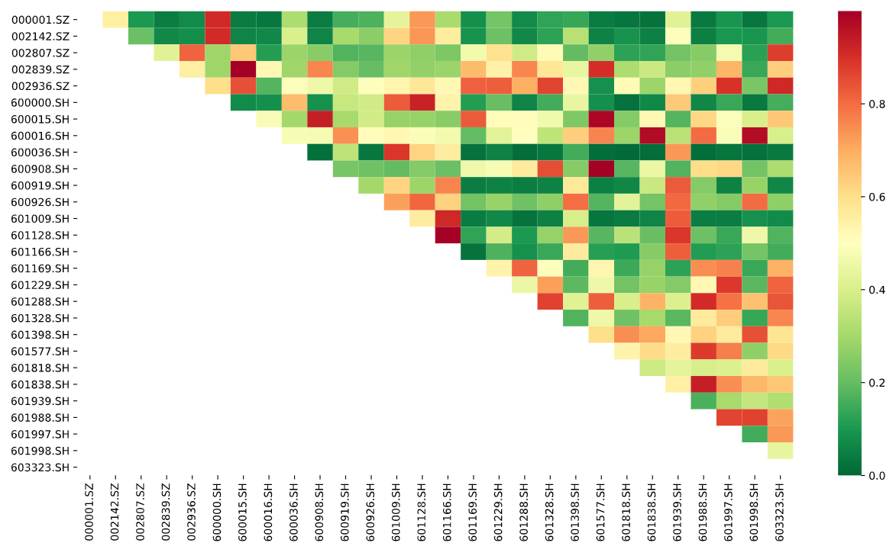
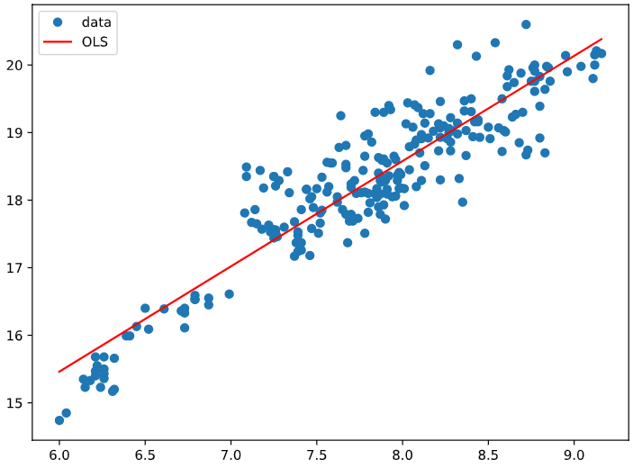
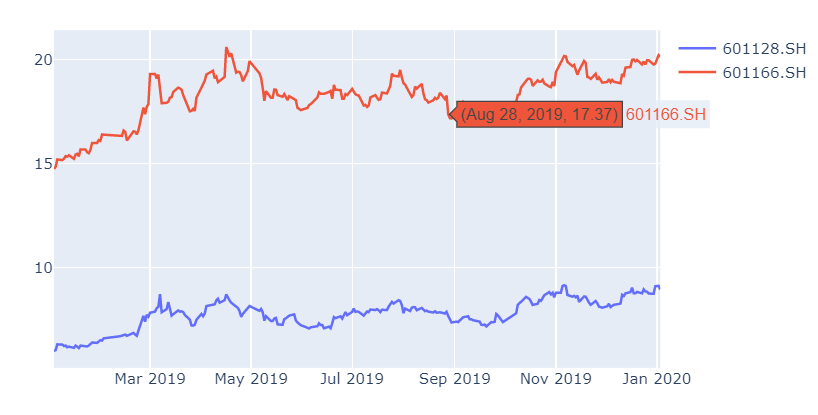
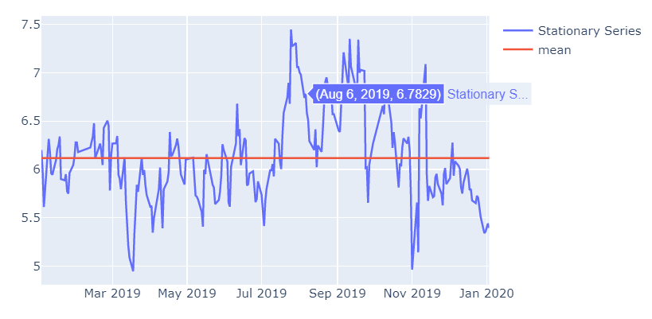
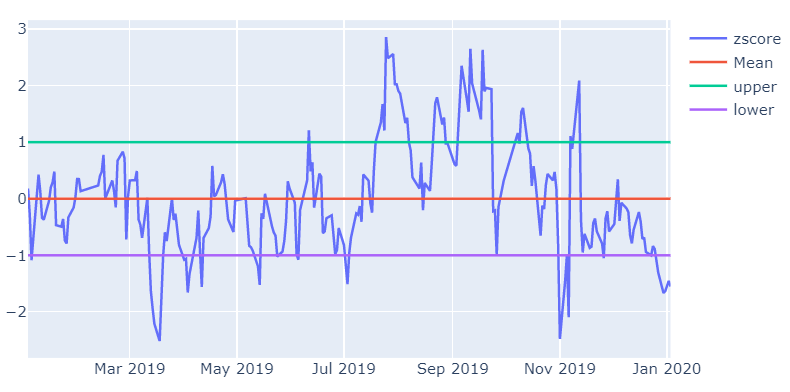
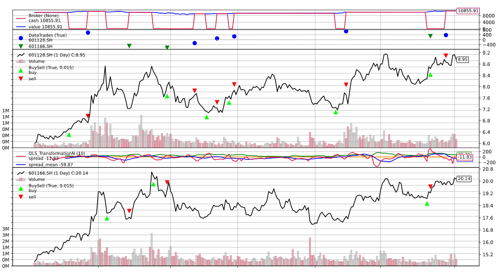

# 量化学习 | 配对交易 backtrader实现

**配对交易**，其基本原理就是找出两只走势相关的股票。这两只股票的价格差距从长期来看在一个固定的水平内波动，如果价差暂时性的超过或低于这个水平，就买多价格偏低的股票，卖空价格偏高的股票。等到价差恢复正常水平时，进行平仓操作，赚取这一过程中价差变化所产生的利润。

其实就是找到两个关联性高的股票A和B，做出调仓策略，**如果觉得当前A价格过高就换B，这里的假设是历史走势相关性高，那么未来也是相关性高的，这里并不无道理，如果现在的价格是相关的，未来短期相关的假设是可以接受的。**

那我们可以用**tushare**获取**银行行业**的股票，基本面相同的情况下，我们认为其走势相关性更高，再在这个范围找出两个相关性高的股票。

本文大部分分析都是根据这篇文章做出的：https://bigquant.com/community/t/topic/260

我这里首先封装了一下**tushare**的常用获取接口后面通过**from stock_api import ***来获取

```python
import tushare as ts

mytoken = 'your_token'
ts.set_token(mytoken)
pro = ts.pro_api()


def get_daily(ts_code, start_date, end_date):
    # get stock daily price and other info from start_date to end_date 
    try:
        df = pro.daily(ts_code=ts_code,
                       start_date=start_date,
                       end_date=end_date)
    except Exception as e:
        print('Retry, We get error:', e)
        df = get_daily()
    return df


def get_stock_basic():
    # get all stock basic info
    try:
        df = pro.stock_basic(
            exchange='',
            list_status='L',
            fields='ts_code,symbol,name,area,industry,list_date')
    except Exception as e:
        print('Retry, We get error:', e)
        df = get_stock_basic()
    return df


def get_daily_basic(trade_date):
    # get all stock daily_basic info
    try:
        df = pro.daily_basic(
            ts_code='',
            trade_date=trade_date,
            fields='ts_code,trade_date,turnover_rate,volume_ratio,pe,pb')
    except Exception as e:
        print('Retry, We get error:', e)
        df = get_daily_basic(trade_date)
    return df


def get_income(code, start_date, end_date):
    try:
        income = pro.income(ts_code=code,
                            start_date=start_date,
                            end_date=end_date,
                            fields='ts_code,basic_eps,diluted_eps')
    except Exception as e:
        print('Retry, We get error:', e)
        income = get_income(code, start_date, end_date)
    return income

```


## 获取行业股票构造字典

```python
import backtrader.plot
import matplotlib
import matplotlib.pyplot as plt
import tushare as ts
from datetime import datetime
import backtrader as bt
import pandas as pd
import os
from stock_api import *
import numpy as np
import statsmodels.api as sm
import seaborn as sns
data = get_stock_basic()
last_year = '20180101'
start_date='20190102'
end_date='20200103'
instruments_code_bank = list(data[data.industry=='银行']['ts_code'])
prices_temp=pd.DataFrame()
for c in instruments_code_bank:
    c_daily = get_daily(c,start_date,end_date)
    prices_temp=prices_temp.append(c_daily)
prices_temp_code_close=prices_temp[['ts_code','close']]
# 获取20190102-20200103的股票出现最多的交易日期长度
# 因为有一些20190102以后中途出现停牌的情况
mode_num = np.argmax(np.bincount([len(i) for i in [prices_temp_code_close[prices_temp_code_close.ts_code==c] for c in instruments_code_bank]])) 
print(mode_num) # 246
# 构造字典通过ts_code索引这一年的收盘价
price_dict_all = dict(list(prices_temp_code_close.groupby('ts_code')['close']))
# 筛选出字典中交易日期跟众数相等的股票，这样才可以分析出更多再股票池里相关性高的一对
price_dict = dict(filter(lambda x:len(x[1])==mode_num, price_dict_all.items()))
instruments_code=list(price_dict.keys())
print(instruments_code)
```

银行股票代码是下面这个列表：

**['000001.SZ', '002142.SZ', '002807.SZ', '002839.SZ', '002936.SZ', '600000.SH', '600015.SH', '600016.SH', '600036.SH', '600908.SH', '600919.SH', '600926.SH', '601009.SH', '601128.SH', '601166.SH', '601169.SH', '601229.SH', '601288.SH', '601328.SH', '601398.SH', '601577.SH', '601818.SH', '601838.SH', '601939.SH', '601988.SH', '601997.SH', '601998.SH', '603323.SH']**

## 相关性分析

```python
# 输入是一price_dict，每一列是一支股票在每一日的价格
def find_cointegrated_pairs(price_dict):
    # 得到price_dict长度
    n = len(price_dict)
    # 初始化p值矩阵
    pvalue_matrix = np.ones((n, n))
    # 抽取列的名称
    keys = list(price_dict.keys())
    mode_num = np.argmax(np.bincount([len(i) for i in list(price_dict.values())]))
    print("keys:",keys)
    # 初始化强协整组
    pairs = []
    # 对于每一个i
    for i in range(n):
        # 对于大于i的j
        stock1 = price_dict[keys[i]]
        if len(stock1)!=mode_num:
            continue
        for j in range(i+1, n):
            # 获取相应的两只股票的价格Series
            stock2 = price_dict[keys[j]]
            if len(stock2)!=mode_num:
                continue
            # 分析它们的协整关系
            result = sm.tsa.stattools.coint(stock1, stock2)
            # 取出并记录p值
            pvalue = result[1]
            pvalue_matrix[i, j] = pvalue
            # 如果p值小于0.05
            if pvalue < 0.05:
                # 记录股票对和相应的p值
                pairs.append((keys[i], keys[j], pvalue))
    # 返回结果
    return pvalue_matrix, pairs
pvalues, pairs = find_cointegrated_pairs(price_dict)
pairs_df = pd.DataFrame(pairs, index=range(0,len(pairs)), columns=list(['bank1','bank2','pvalue']))
#pvalue越小表示相关性越大,按pvalue升序排名就是获取相关性从大到小的股票对
pairs_df=pairs_df.sort_values(by='pvalue')
pairs_df
```

这里是相关性分析，每个股票之间都做**sm.tsa.stattools.coint**的协整性关系计算，p值小于0.05的放进pairs里考虑，**p值越小相关性越高**。

```python
%matplotlib inline
plt.rcParams['figure.figsize'] = [15, 8]
sns.heatmap(1-pvalues, xticklabels=instruments_code, yticklabels=instruments_code, cmap='RdYlGn_r', mask = (pvalues == 1))
```

股票对的相关性热度图：



热度图中越红表示相关性越高，表示p值越小

pairs_df是下面这个表格显示：

|     bank1 |     bank2 | pvalue   |
| --------: | --------: | -------- |
| 601128.SH | 601166.SH | 0.000734 |
| 600908.SH | 601577.SH | 0.002515 |
| 002839.SZ | 600015.SH | 0.002777 |
| 600015.SH | 601577.SH | 0.012600 |
| 600016.SH | 601838.SH | 0.027678 |
| 600016.SH | 601998.SH | 0.030310 |

可以看到601128.SH 和601166.SH 相关性最高，他们是

-   **601128.SH 常熟银行 X**
-   **601166.SH 兴业银行 Y**

```python
# bank_choose = ['601128.SH','601166.SH']
bank_choose = [pairs_df.iloc[0].bank1,pairs_df.iloc[0].bank2]
# bank_choose
x = price_dict[bank_choose[0]]
y = price_dict[bank_choose[1]]
X = sm.add_constant(x)
result = (sm.OLS(y,X)).fit()
print(result.summary())
```

```shell
OLS Regression Results                            
==============================================================================
Dep. Variable:                  close   R-squared:                       0.853
Model:                            OLS   Adj. R-squared:                  0.852
Method:                 Least Squares   F-statistic:                     1415.
Date:                Fri, 20 Mar 2020   Prob (F-statistic):          1.51e-103
Time:                        22:43:54   Log-Likelihood:                -160.79
No. Observations:                 246   AIC:                             325.6
Df Residuals:                     244   BIC:                             332.6
Df Model:                           1                                         
Covariance Type:            nonrobust                                         
==============================================================================
                 coef    std err          t      P>|t|      [0.025      0.975]
------------------------------------------------------------------------------
const          6.1175      0.324     18.883      0.000       5.479       6.756
close          1.5575      0.041     37.617      0.000       1.476       1.639
==============================================================================
Omnibus:                        9.358   Durbin-Watson:                   0.324
Prob(Omnibus):                  0.009   Jarque-Bera (JB):                9.387
Skew:                           0.468   Prob(JB):                      0.00915
Kurtosis:                       3.199   Cond. No.                         86.5
==============================================================================
```


可以看到OLS线性回归之后，算出它们是以什么系数线性组合的系数构成平稳序列的。

**Y = 1.5575*X + 6.1175** 

画出数据和拟合线：

```python
fig, ax = plt.subplots(figsize=(8,6))
ax.plot(x, y, 'o', label="data")
ax.plot(x, result.fittedvalues, 'r', label="OLS")
ax.legend(loc='best')
```



后面我想观察一下**601128.SH 常熟银行 X 和601166.SH 兴业银行 Y**是否真的相关，历史行情看一下走势，为此封装了一下**plotly.graph_objects**的函数：

```python
def plot_scatter(fig, y, x=None, name=None, title=None, show=True):
    fig.add_trace(go.Scatter(y=y, x=x, name=name))
    fig.update_layout(title=title)
    if show:
        fig.show()
```

这里[::-1]都是为了把dataframe或者list倒过来，因为tushare获得的数据都是从最近的日期排下来的，譬如我这里20200103是index为0的数据，所以这里我为了画图倒过来了。

```python
trade_date = prices_temp['trade_date'].unique()
date_series = pd.to_datetime(trade_date[::-1])
date_series
fig = go.Figure()
plot_scatter(fig, y=price_dict[bank_choose[0]][::-1], x=date_series, name=bank_choose[0], show=False)
plot_scatter(fig, y=price_dict[bank_choose[1]][::-1], x=date_series, name=bank_choose[1], show=True)
```



```python
fig = go.Figure()
plot_scatter(fig, y=y-1.5575*x, x=date_series, name='Stationary Series', show=False)
plot_scatter(fig, y=[np.mean(y-1.5575*x)]*len(y), x=date_series, name='mean', show=True)
```




## 买卖时机的判断

这里，我们先介绍一下, z−score 是对时间序列偏离其均值程度的衡量，表示时间序列偏离了其均值多少倍的标准差。首先，我们定义一个函数来计算 z−score：

一个序列在时间 t 的 z−score，是它在时间 t 的值，减去序列的均值，再除以序列的标准差后得到的值。

```python
def zscore(series):
    return (series - series.mean()) / np.std(series)

zscore_calcu = zscore(y-1.5575*x)
fig_bs=go.Figure()
plot_scatter(fig_bs,zscore_calcu,date_series,name='zscore',show=False)
plot_scatter(fig_bs,[0.]*len(y),date_series,name='Mean',show=False) # np.mean(zscore_calcu)=0.
plot_scatter(fig_bs,[1.]*len(y),date_series,name='upper',show=False)
plot_scatter(fig_bs,[-1.]*len(y),date_series,name='lower',show=True)
```




其实很简单的策略，就是当zscore大于1的时候我们认为Y的估值相对X已经过高，考虑卖出Y买入X，当小于-1的时候相反。

## backtrader策略实现

1.交易标的：**601128.SH 常熟银行 X和601166.SH 兴业银行 Y**

2.交易信号： 当zscore大于1时，全仓买入data0常熟银行，全仓卖出data1兴业银行→做空价差 当zscore小于-1时，全仓卖出data0常熟银行，全仓买入data1兴业银行→做多价差

策略如下，写完策略可以直接传递给runner：

```python
import backtrader as bt
import backtrader.feeds as btfeeds
import backtrader.indicators as btind


class PairTradingStrategy(bt.Strategy):
    params = dict(
        period=10,
        qty1=0,
        qty2=0,
        printout=False,
        upper=1,
        lower=-1,
        up_medium=0.5,
        low_medium=-0.5,
        status=0,
    )
	# 这里说明一下；self.p.upper即可访问params里的参数，这是bt.Strategy里实现的
    # 所以这里params一般都是声明跟策略相关的变量，可以通过self.p的属性进行获取
    def log(self, txt, dt=None):
        if self.p.printout:
            dt = dt or self.data.datetime[0]
            dt = bt.num2date(dt)

    def notify_order(self, order):
        if order.status in [bt.Order.Submitted, bt.Order.Accepted]:
            return  # Await further notifications

        if order.status == order.Completed:
            if order.isbuy():
                buytxt = 'BUY COMPLETE, %.2f' % order.executed.price
                self.log(buytxt, order.executed.dt)
            else:
                selltxt = 'SELL COMPLETE, %.2f' % order.executed.price
                self.log(selltxt, order.executed.dt)

        elif order.status in [order.Expired, order.Canceled, order.Margin]:
            self.log('%s ,' % order.Status[order.status])
            pass  # Simply log

        # Allow new orders
        self.orderid = None

    def __init__(self):
        # To control operation entries
        self.orderid = None
        self.qty1 = self.p.qty1
        self.qty2 = self.p.qty2
        self.upper_limit = self.p.upper
        self.lower_limit = self.p.lower
        self.up_medium = self.p.up_medium
        self.low_medium = self.p.low_medium
        self.status = self.p.status

        # Signals performed with PD.OLS :
        self.transform = btind.OLS_TransformationN(self.data0, self.data1,
                                                   period=self.p.period)
        self.zscore = self.transform.zscore

    def next(self):

        if self.orderid:
            return  # if an order is active, no new orders are allowed

        if self.p.printout:
            print('Self  len:', len(self))
            print('Data0 len:', len(self.data0))
            print('Data1 len:', len(self.data1))
            print('Data0 len == Data1 len:',
                  len(self.data0) == len(self.data1))

            print('Data0 dt:', self.data0.datetime.datetime())
            print('Data1 dt:', self.data1.datetime.datetime())

            print('status is', self.status)
            print('zscore is', self.zscore[0])

        if (self.zscore[0] > self.upper_limit) and (self.status != 1):
            self.status = 1
            self.order_target_percent(self.data1,0) # data1 = y
            self.order_target_percent(self.data0,1) # data0 = x

        elif (self.zscore[0] < self.lower_limit) and (self.status != 2):
            self.order_target_percent(self.data0,0) # data0 = x
            self.order_target_percent(self.data1,1) # data1 = y
            self.status = 2 


    def stop(self):
        print('==================================================')
        print('Starting Value - %.2f' % self.broker.startingcash)
        print('Ending   Value - %.2f' % self.broker.getvalue())
        print('==================================================')
```

根据之前写过的策略，我封装了一个Strategy_runner，后面继承为多数据策略的runner，这里不看也不妨碍理解：

```python
from datetime import datetime
import backtrader as bt
import pandas as pd
import os
import tushare as ts
import matplotlib
import matplotlib.pyplot as plt
from stock_api import get_daily
matplotlib.use('agg')
data_path = './data/'
if not os.path.exists(data_path):
    os.makedirs(data_path)
mytoken = 'your_token'


class Strategy_runner:
    def __init__(self,
                 strategy,
                 ts_code,
                 start_date,
                 end_date,
                 data_path=data_path,
                 pro=True,
                 token=mytoken):
        ts.set_token(mytoken)
        pro = ts.pro_api()
        self.ts_code = ts_code
        self.start_date = start_date
        self.end_date = end_date
        self.data_path = data_path
        # convert to datetime
        self.start_datetime = datetime.strptime(start_date, '%Y%m%d')
        self.end_datetime = datetime.strptime(end_date, '%Y%m%d')
        df = self.read_save(self.ts_code, pro)
        self.df_bt = self.preprocess(df, pro)
        self.strategy = strategy
        self.cerebro = bt.Cerebro()

    def read_save(self, ts_code, pro=True):
        if pro:
            csv_name = f'pro_day_{str(ts_code)}-{str(self.start_date)}-{str(self.end_date)}.csv'
        else:
            csv_name = f'day_{str(ts_code)}-{str(self.start_date)}-{str(self.end_date)}.csv'
        csv_path = os.path.join(self.data_path, csv_name)
        if os.path.exists(csv_path):
            if pro:
                df = pd.read_csv(csv_path)
            else:
                df = pd.read_csv(csv_path, index_col=0)
        else:
            if pro:
                # self.pro = ts.pro_api()
                # self.df = self.pro.daily(ts_code=self.ts_code, start_date=self.start_date, end_date=self.end_date)
                df = get_daily(ts_code, self.start_date, self.end_date)
                if not df.empty:
                    df.to_csv(csv_path, index=False)
            else:
                df = ts.get_hist_data(ts_code, str(self.start_datetime),
                                      str(self.end_datetime))
                if not df.empty:
                    df.to_csv(csv_path, index=True)
        return df

    def preprocess(self, df, pro=False):
        if pro:
            features = ['open', 'high', 'low', 'close', 'vol', 'trade_date']
            # convert_datetime = lambda x:datetime.strptime(x,'%Y%m%d')
            convert_datetime = lambda x: pd.to_datetime(str(x))
            df['trade_date'] = df['trade_date'].apply(convert_datetime)
            bt_col_dict = {'vol': 'volume', 'trade_date': 'datetime'}
            df = df.rename(columns=bt_col_dict)
            df = df.set_index('datetime')
            # df.index = pd.DatetimeIndex(df.index)
        else:
            features = ['open', 'high', 'low', 'close', 'volume']
            df = df[features]
            df['openinterest'] = 0
            df.index = pd.DatetimeIndex(df.index)

        df = df[::-1]
        return df

    def run(self):
        data = bt.feeds.PandasData(dataname=self.df_bt,
                                   fromdate=self.start_datetime,
                                   todate=self.end_datetime)
        self.cerebro.adddata(data)  # Add the data feed
        self.cerebro.addstrategy(self.strategy)  # Add the trading strategy
        # self.cerebro.broker.setcash(1000.0)
        # self.cerebro.addsizer(bt.sizers.FixedSize, stake=100)
        self.cerebro.broker.setcommission(commission=0.0)  # 佣金
        self.cerebro.addanalyzer(bt.analyzers.SharpeRatio, _name='SharpeRatio')
        self.cerebro.addanalyzer(bt.analyzers.DrawDown, _name='DW')
        self.results = self.cerebro.run()
        strat = self.results[0]
        print('Final Portfolio Value: %.2f' % self.cerebro.broker.getvalue())
        print('SR:', strat.analyzers.SharpeRatio.get_analysis())
        print('DW:', strat.analyzers.DW.get_analysis())
        return self.cerebro, strat

    def plot(self, iplot=False):
        plt.rcParams['figure.figsize'] = [15, 8]
        self.cerebro.plot(iplot=iplot)


def test():
    from SmaCross import SmaCross
    ts_code = '600515.SH'
    start_date = '20190101'
    end_date = '20191231'
    strategy_runner = Strategy_runner(strategy=SmaCross,
                                      ts_code=ts_code,
                                      start_date=start_date,
                                      end_date=end_date,
                                      pro=True)
    results = strategy_runner.run()
    strategy_runner.plot()
    return results


if __name__ == '__main__':
    test()
```

继承封装为其投入多条股票数据,主要就是多一个ts_code1：

```python
from Strategy_runner import Strategy_runner
data_path = './data/'
if not os.path.exists(data_path):
    os.makedirs(data_path)
mytoken = 'your_token'
class Multidata_Strategy_runner(Strategy_runner):
    def __init__(self, strategy, ts_code, ts_code1, start_date, end_date, data_path=data_path, pro=True, token=mytoken):
        super().__init__(strategy, ts_code, start_date, end_date, data_path=data_path, pro=True, token=mytoken)
        self.ts_code1 = ts_code1
        df1 = super().read_save(self.ts_code1, pro)
        self.df_bt1 = super().preprocess(df1, pro)

    def run(self):
        data = bt.feeds.PandasData(dataname=self.df_bt,
                                   fromdate=self.start_datetime,
                                   todate=self.end_datetime)
        data1 = bt.feeds.PandasData(dataname=self.df_bt1,
                                   fromdate=self.start_datetime,
                                   todate=self.end_datetime)
        self.cerebro.adddata(data, name=self.ts_code)  # Add the data feed
        self.cerebro.adddata(data1, name=self.ts_code1)  # Add the data feed
        self.cerebro.addstrategy(self.strategy)  # Add the trading strategy
        # self.cerebro.broker.setcash(1000.0)
        # self.cerebro.addsizer(bt.sizers.FixedSize, stake=100)
        self.cerebro.broker.setcommission(commission=0.0)  # 佣金
        self.cerebro.addanalyzer(bt.analyzers.SharpeRatio, _name='SharpeRatio')
        self.cerebro.addanalyzer(bt.analyzers.DrawDown, _name='DW')
        self.results = self.cerebro.run()
        strat = self.results[0]
        print('Final Portfolio Value: %.2f' % self.cerebro.broker.getvalue())
        print('SR:', strat.analyzers.SharpeRatio.get_analysis())
        print('DW:', strat.analyzers.DW.get_analysis())
        return self.cerebro, strat

```

run一下：

```python
strategy_runner = Multidata_Strategy_runner(strategy=PairTradingStrategy, ts_code=bank_choose[0], ts_code1=bank_choose[1],start_date=start_date, end_date=end_date, pro=True)
cerebro, strat = strategy_runner.run()
strategy_runner.plot()
```

```shell
==================================================
Starting Value - 10000.00
Ending   Value - 10855.91
==================================================
Final Portfolio Value: 10855.91
SR: OrderedDict([('sharperatio', 0.7663305721395932)])
DW: AutoOrderedDict([('len', 12), ('drawdown', 0.9858628237869406), ('moneydown', 108.09000000000015), ('max', AutoOrderedDict([('len', 202), ('drawdown', 18.257629657367524), ('moneydown', 1950.2799999999988)]))])
```

最后赚了855.91元。




## 总结

实现过程并不难，主要是为了分析这个策略的可行性，理解其思想，首先配对交易的假设是未来走势也与现在分析的存在较高相关性，但是是否真是如此，如果后面走势不一致，以及价值不符合市场，暴跌暴升是否能预测出呢？


