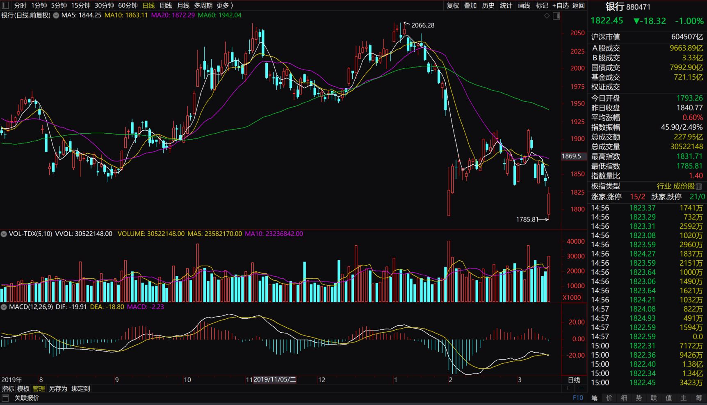
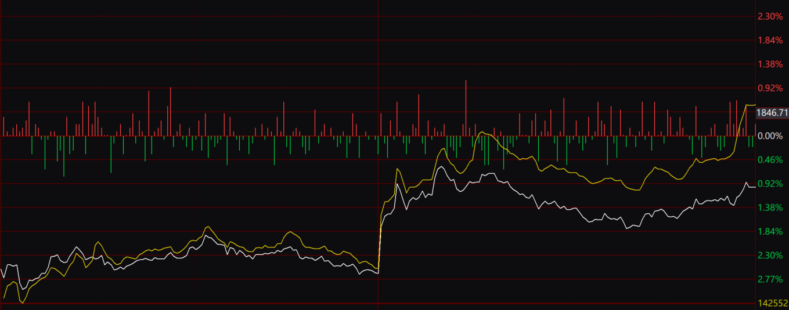

# 量化学习 | Tushare 基本面选股 （二）

量化投资比较重要的是策略，可是你得先选个好股，价值投资需要认同他的价值，值得投资的股票才有投资的机会，现在简单介绍一下基于基本面的选股，其实我现实生活中也有炒股，都是经验之说的选股原则。


首先从tushare中获取每日指标 [pro.daily_basic](https://tushare.pro/document/2?doc_id=32)

```python
last_year = '20190101'
start_date = '20200313'
mytoken='your_token'
ts.set_token(mytoken)
pro = ts.pro_api()
df = pro.daily_basic(ts_code='', trade_date=start_date, fields='ts_code,trade_date,turnover_rate,volume_ratio,pe,pb')
```

P.S. 用户需要至少300积分才可以调取，我是学生进了官方群之后管理员帮我升级到了2000积分，所以大部分接口我都能使用。欢迎大家在我的链接下注册会送我**积分**：

https://tushare.pro/register?reg=355247

首先我们筛选PE为15以下的，PB为7一下的股票：

-   PE是每股股价除以每股收益。如果股价是10元/股，每股收益是1元，PE就相当于10倍，你买这家公司的价钱相当于付出这家公司每年盈利的倍数。一般30以下才觉得可以接受。
-   PB是每股股价除以每股净资产的倍数。如果股价是10元/股，净资产是5元/股，PB就是2倍，也相当于付出的是这个公司净资产的2倍。一般8以下可以接受，我这里调整成小一些，因为最近跌幅挺大的，所以很多公司跌破净资产。

```python
PE_T = 15
PB_T = 1
df_choose = df[(df.pe<=PE_T)&(df.pb<=PB_T)]
```

符合条件的有**198**只股票，接着我们筛选一下近期公布的收益

收益可以通过[pro.income](https://tushare.pro/document/2?doc_id=33)接口查询：

```python
income = []
for c in df_choose.ts_code:
    df_income = pro.income(ts_code=c,start_date=last_year,end_date=start_date,fields='ts_code,ann_date,f_ann_date,end_date,report_type,comp_type,basic_eps,diluted_eps')
    income.append(df_income['basic_eps'].iloc[0])
df_choose['basic_eps']=income
df_choose_good = df_choose[df_choose.basic_eps>1.0]
print(len(df_choose_good))
```

收益大于**1.0**的股票**df_choose_good**中含有**23**只股票

接着我想得出这些这些股票代码的股票名字，可以查询这个接口[pro.stock_basic](https://tushare.pro/document/2?doc_id=25) ，并且我存下该表格。

```python
data_path = './data/'
if not os.path.exists(data_path):
    os.makedirs(data_path)
csv_name = f'allname_data.csv'
csv_path = os.path.join(data_path,csv_name)
data = pro.stock_basic(exchange='', list_status='L', fields='ts_code,symbol,name,area,industry,list_date')
data.to_csv(csv_path, index=False)
```

```python
data[data.ts_code.isin(df_choose_good.ts_code)]
```

|      |   ts_code | symbol |     name | area | industry | list_date |
| ---: | --------: | -----: | -------: | ---: | -------: | --------: |
|   33 | 000042.SZ | 000042 | 中洲控股 | 深圳 | 全国地产 |  19940921 |
|   97 | 000501.SZ | 000501 |  鄂武商A | 湖北 |     百货 |  19921120 |
|  480 | 002024.SZ | 002024 | 苏宁易购 | 江苏 | 电器连锁 |  20040721 |
|  583 | 002128.SZ | 002128 | 露天煤业 | 内蒙 | 煤炭开采 |  20070418 |
|  600 | 002146.SZ | 002146 | 荣盛发展 | 河北 | 全国地产 |  20070808 |
| 2201 | 600000.SH | 600000 | 浦发银行 | 上海 |     银行 |  19991110 |
| 2211 | 600016.SH | 600016 | 民生银行 | 北京 |     银行 |  20001219 |
| 2247 | 600064.SH | 600064 | 南京高科 | 江苏 | 园区开发 |  19970506 |
| 2356 | 600188.SH | 600188 | 兖州煤业 | 山东 | 煤炭开采 |  19980701 |
| 2564 | 600449.SH | 600449 | 宁夏建材 | 宁夏 |     水泥 |  20030829 |
| 2770 | 600694.SH | 600694 | 大商股份 | 辽宁 |     百货 |  19931122 |
| 2773 | 600697.SH | 600697 | 欧亚集团 | 吉林 |     百货 |  19931206 |
| 2919 | 600859.SH | 600859 |   王府井 | 北京 |     百货 |  19940506 |
| 2964 | 600919.SH | 600919 | 江苏银行 | 江苏 |     银行 |  20160802 |
| 2965 | 600926.SH | 600926 | 杭州银行 | 浙江 |     银行 |  20161027 |
| 3034 | 601088.SH | 601088 | 中国神华 | 北京 | 煤炭开采 |  20071009 |
| 3062 | 601186.SH | 601186 | 中国铁建 | 北京 | 建筑工程 |  20080310 |
| 3076 | 601229.SH | 601229 | 上海银行 | 上海 |     银行 |  20161116 |
| 3111 | 601577.SH | 601577 | 长沙银行 | 湖南 |     银行 |  20180926 |
| 3134 | 601677.SH | 601677 | 明泰铝业 | 河南 |       铝 |  20110919 |
| 3157 | 601828.SH | 601828 |   美凯龙 | 上海 | 其他商业 |  20180117 |
| 3158 | 601838.SH | 601838 | 成都银行 | 四川 |     银行 |  20180131 |
| 3201 | 601997.SH | 601997 | 贵阳银行 | 贵州 |     银行 |  20160816 |

这个就是选出来的股，看来银行最近跌得挺厉害的，看好银行在后期反弹。






| ts_code |    symbol |   name |     area | industry | list_date |          |
| ------: | --------: | -----: | -------: | -------: | --------: | -------- |
|       0 | 000001.SZ |      1 | 平安银行 |     深圳 |      银行 | 19910403 |
|     140 | 000553.SZ |    553 |  安道麦A |     湖北 |  农药化肥 | 19931203 |
|     272 | 000732.SZ |    732 | 泰禾集团 |     福建 |  区域地产 | 19970704 |
|    2201 | 600000.SH | 600000 | 浦发银行 |     上海 |      银行 | 19991110 |
|    2210 | 600015.SH | 600015 | 华夏银行 |     北京 |      银行 | 20030912 |
|    2356 | 600188.SH | 600188 | 兖州煤业 |     山东 |  煤炭开采 | 19980701 |
|    2522 | 600383.SH | 600383 | 金地集团 |     深圳 |  全国地产 | 20010412 |
|    2608 | 600508.SH | 600508 | 上海能源 |     上海 |  煤炭开采 | 20010829 |
|    2770 | 600694.SH | 600694 | 大商股份 |     辽宁 |      百货 | 19931122 |
|    2852 | 600782.SH | 600782 | 新钢股份 |     江西 |      普钢 | 19961225 |
|    2919 | 600859.SH | 600859 |   王府井 |     北京 |      百货 | 19940506 |
|    3016 | 601009.SH | 601009 | 南京银行 |     江苏 |      银行 | 20070719 |
|    3057 | 601166.SH | 601166 | 兴业银行 |     福建 |      银行 | 20070205 |
|    3076 | 601229.SH | 601229 | 上海银行 |     上海 |      银行 | 20161116 |
|    3157 | 601828.SH | 601828 |   美凯龙 |     上海 |  其他商业 | 20180117 |
|    3201 | 601997.SH | 601997 | 贵阳银行 |     贵州 |      银行 | 20160816 |