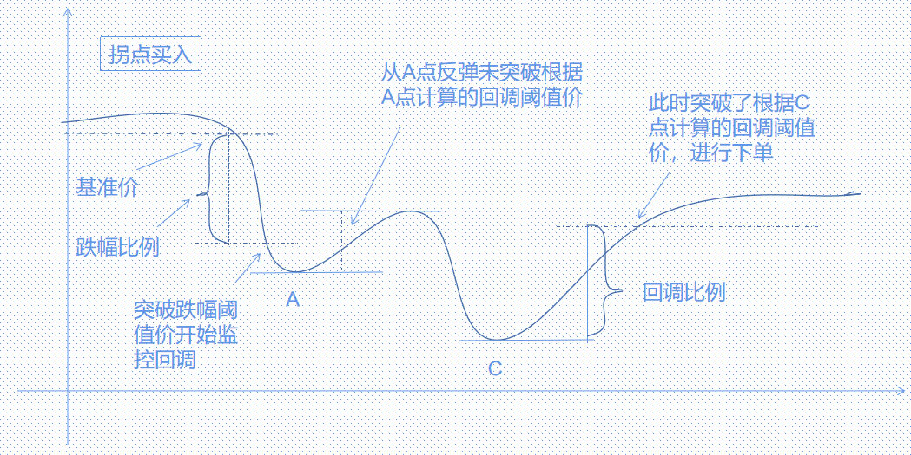
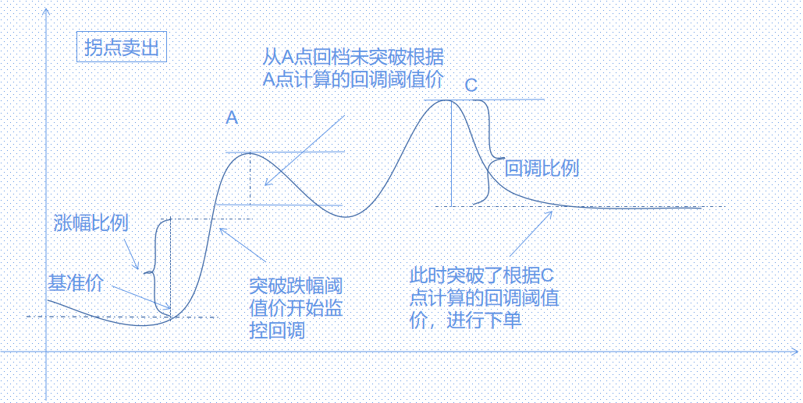

## 拐点交易
### 基本原理
买入：通过基准价与跌幅比例计算跌幅阈值价，当最新价突破跌幅阈值后，以突破后的最低价与回调比例计算回调阈值价，当最新价突破回调阈值后，以价格策略设定的报价方式挂单买入。



卖出：通过基准价与涨幅比例计算涨幅阈值价，当最新价突破涨幅阈值后，以突破后的最高价与回调比例计算回调阈值价，当最新价突破回调阈值后，以价格策略设定的报价方式挂单卖出。



### 使用方法
点击拐点交易，填写参数后点击添加条件。即可设置拐点交易策略

### 策略实现

```python

```

### 回测结果

