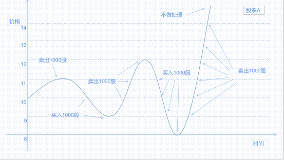

## 网格交易

网格交易用来在设定的范围内自动调整标的的仓位。设置的参数有初始价格中枢p，网格宽度w， 单次买入卖出数量v。 假定初始持仓为N股，当从初始开始，股价波动到p+w+0.01时策略调整持仓到N-v股，如果继续上涨到p+2w+0.01策略调整持仓到N-2v。此时如果股价跌回p+w策略调整持仓回到N-v。其他可依次类推，凡是当价格上涨到指定价格超过1分钱时卖出，而下跌触及到指定价时买入。从初始价格向单一方向波动超过4个w的宽度后（不含p±4w），策略不做处理。

示例：比如想要对一个标的A执行以下操作：假设A现价10元，持有4000股。希望在11元时调整持仓为3000股，9元时调整为5000股，12元时调整持仓2000股，8元的时候再卖出6000股。可以设置网格价格中枢：10，网格宽度：1 买卖数量：1000。



### 使用方法
点击网格交易，设置证券代码为‘SHSE.600000’、价格中枢为 10 元、每格买入100股、价格区间为1元、网格个数选择 8、有效期选择‘当日有效’、然后点击添加条件按钮就可以成功设置网格交易策略了。

### 策略实现

```python

```

### 回测结果
