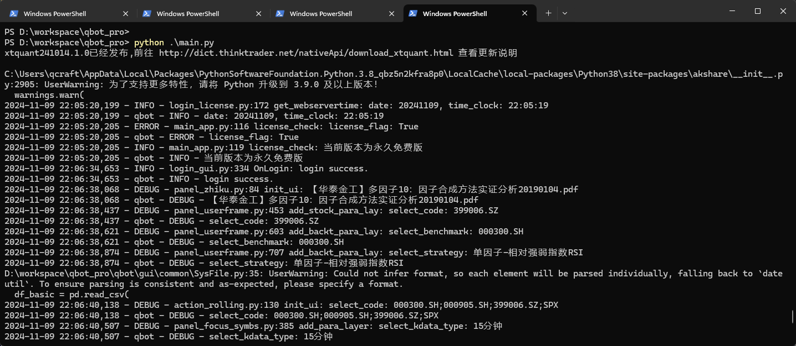
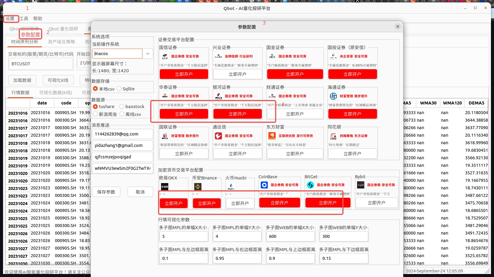
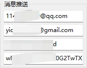

# Install
Qbot is a python package, so you need to install python first. We recommend you to use Anaconda to install python and other packages.

- <b>Qbot 目前仅在 python3.8 pyhont3.9 下测试过，其他版本未测试。</b>
- <b>Qbot 倡导每个交易员都应搭建属于自己的交易系统；所以我们源代码交付；</b>
- <b>Qbot 支持非商业用途的二次开发；</b>
- <b>[Qbot 用户协议](docs/Qbot用户协议)；</b>

## Quick Start

### 1. 打开系统终端：

#### MacOS


> 推荐使用``Iterm2`` https://iterm2.com/index.html 直接下载安装即可。

#### Linux(Ubuntu)

打开系统终端即可。

#### Windows

推荐使用PowerShell。



### 2. 下载qbot源代码到本地

qbot-pro 为付费版本，微信联系 Yida_Zhang2 获取下载权限

```bash
cd ~/
git clone https://github.com/UFund-Me/qbot_pro
```

### 第一种：Anaconda 

如果已经有Python3.8、3.9环境可直接跳到第五步，安装依赖库，启动Qbot。

1. 下载安装Conda

```bash
wget https://repo.continuum.io/archive/Anaconda3-5.3.1-Linux-x86_64.sh
bash Anaconda3-5.3.1-Linux-x86_64.sh
```
2. 编辑 ``~/.bashrc`` 文件，在最后面加上

``export PATH=$HOME/anaconda3/bin:$PATH``

保存退出后：``source ~/.bashrc``

3. 再次输入``conda list``测试

4. 创建conda环境：

```bash
conda create -n Qbot python=3.8
conda activate Qbot
```

5. 安装依赖包：
```bash
pip config set global.index-url https://pypi.tuna.tsinghua.edu.cn/simple

cd qbot_pro
# pip install -r requirements.txt
pip install --no-index --find-links=$(pwd)/dev -r requirements.txt
```

> [!NOTE]
> wxPython、Ta-Lib 需要手动安装，pip wheel 在 dev/ 路径下。https://github.com/UFund-Me/Qbot/issues/76
> 参考文档： 
> - wxPython https://wxpython.org/Phoenix/snapshot-builds/   https://pypi.org/project/wxPython/#files 
> - #wxPython
> - linux: python3.8 -m pip install dev/wxPython-4.2.0-cp38-cp38-linux_x86_64.whl
>          pip install -U \
            -f https://extras.wxpython.org/wxPython4/extras/linux/gtk3/ubuntu-20.04/\
            wxPython
           pip install -U \
            -f https://extras.wxpython.org/wxPython4/extras/linux/gtk3/ubuntu-18.04/\
            wxPython
> - win: python3.8 -m pip install dev/wxPython-4.2.1-cp38-cp38-win_amd64.whl
> - mac: brew install wxpython
> 
> - #Ta-Lib https://github.com/cgohlke/talib-build/releases
> - linux: python3.8 -m pip install dev/TA_Lib-0.4.28-cp38-cp38-linux_x86_64.whl
> - win: python3.8 -m pip pip install dev/TA_Lib-0.4.21-cp38-cp38-win_amd64.whl
> - mac: 
>       which brew || /usr/bin/ruby -e "$(curl -fsSL https://raw.githubusercontent.com/Homebrew/install/master/install)"
>       brew install ta-lib
>       pip install ta-lib

> [!NOTE]
> - <details><summary>Mac系统在安装之前需要手动安装tables库的依赖hdf5，以及pythonw https://github.com/UFund-Me/Qbot/issues/11 </summary>
> <code>
>   brew install hdf5
>   brew install c-blosc
>   export HDF5_DIR=/opt/homebrew/opt/hdf5 
>   export BLOSC_DIR=/opt/homebrew/opt/c-blosc
> </code>
> </details>

----
> [!TIPS]
> 如果通过 requirements.txt 安装python依赖库出现问题，也可以直接运行'python main.py'，根据提示缺省的库手动安装。 
>  ``pip install baostock tables -i https://pypi.tuna.tsinghua.edu.cn/simple/ --trusted-host pypi.tuna.tsinghua.edu.cn``


### 第二种：Docker

这方式还在开发中，请耐心等待。

```bash
cd ~/qbot_pro/dev
docker build -t ufune-me:qbot-1.0.0 . 
docker images 
docker start <image-id>
docker exec -it <container-id> bash
```

## 系统设置和账号配置

2.1 获取加密货币/股票/期货的账号、或token、或api_key、或api_secret



- 获取币安API的 api_key 和 api_secret

申请api_key地址: [币安API管理页面](https://www.binance.com/cn/usercenter/settings/api-management)

- 证券开户，获取交易api的token、账号

微信私信我 Yida_Zhang2，低佣金开户，提供交易api的token、账号

获取加密货币交易所的api_key和api_secret后，在设置->参数配置-> 点击对应交易平台下方'立即开始'，填写对应的api_key和api_secret即可。

2.2 消息通知参数配置（可选）



## Run：启动Qbot

```bash
python main.py
# if run on Mac, please use 'pythonw main.py'
```

> [!TIP]
> 主要功能一览介绍
> ### 1. 回测功能


> ### 2. ChatGPT策略编写/智能问答


> ### 3. 智能选股、智能鉴股


> ### 4. 基金策略分析，回测分析


> ### 5. 策略模拟交易（掘金仿真）


## Advanced 

Auto run with ci 'auto-trade.yml' workflows, eg: